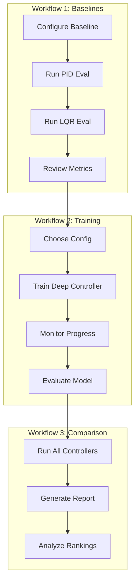

# Quadcopter Target Tracking Research

[](CHANGELOG.md)
[](https://www.python.org/downloads/)
[](LICENSE)

A Python-based research repository for quadcopter target-tracking studies with LQR and ML-based controllers.

## Project Goals

This project provides a simulation environment and controller implementations for studying quadcopter target-tracking problems. The primary objectives are:

1. **Evaluate classical control methods** (LQR, PID) for target tracking
2. **Train and compare learning-based approaches** using deep reinforcement learning
3. **Establish reproducible benchmarks** for tracking performance
4. **Document research findings** systematically

## Assumptions

The current implementation makes the following simplifying assumptions:

- **Perfect target information**: The quadcopter has exact knowledge of target position and velocity (no sensor noise)
- **Smooth target motion**: Target trajectories are differentiable and continuous
- **Idealized dynamics**: Simplified quadcopter model without disturbances
- **3D tracking**: Full spatial tracking problem in three dimensions

These assumptions will be relaxed in future iterations as the research progresses.

## Success Criteria

A tracking episode is considered **successful** when:

| Metric | Threshold |
|--------|-----------|
| Episode duration | ≥ 30 seconds |
| On-target ratio | ≥ 80% |
| Target radius | ≤ 0.5 meters |

**Definition**: The quadcopter is "on-target" when its position is within 0.5 meters of the target position. Success requires maintaining this proximity for at least 80% of episodes lasting 30 seconds or more.

## Installation

### Requirements
- Python 3.10+
- Linux (recommended), macOS, or Windows

### Setup

```bash
# Clone the repository
git clone https://github.com/AgentFoundryExamples/lqr-quadcopter-test.git
cd lqr-quadcopter-test

# Install with dependencies
make install

# Or install with development dependencies
make dev-install
```

### GPU Support

PyTorch is included for future ML-based controllers. For GPU support:
- Install CUDA toolkit (11.8+ recommended)
- PyTorch will automatically use GPU if available

For CPU-only machines:
- No additional setup required
- Set `CUDA_VISIBLE_DEVICES=""` to force CPU usage

## Quick Start

### Run an Experiment

```bash
# Run with default configuration
make run-experiment

# Run with custom seed
make run-experiment SEED=123

# Run with custom config file
make run-experiment CONFIG=configs/circular.yaml
```

### Configuration

Copy the example environment file and customize:

```bash
cp .env.example .env
# Edit .env with your preferred settings
```

Key configuration parameters:
- `QUADCOPTER_SEED`: Random seed for reproducibility
- `QUADCOPTER_EPISODE_LENGTH`: Duration of tracking episodes (seconds)
- `QUADCOPTER_TARGET_RADIUS`: On-target threshold (meters)
- `QUADCOPTER_TARGET_MOTION_TYPE`: Target motion pattern (stationary (default), linear, circular, sinusoidal)

See [.env.example](.env.example) for all available options.

## Project Structure

```
├── src/
│   ├── env/           # Environment simulation
│   ├── controllers/   # Controller implementations (LQR, PID, Neural)
│   ├── utils/         # Shared utilities and loss functions
│   └── train.py       # Deep learning training script
├── experiments/
│   └── configs/       # Training configuration files
├── docs/              # Documentation
│   ├── architecture.md
│   ├── environment.md
│   └── training.md
├── tests/             # Test suite
├── pyproject.toml     # Python package configuration
├── Makefile           # CLI commands
├── .env.example       # Environment variable template
└── README.md          # This file
```

See [docs/architecture.md](docs/architecture.md) for detailed architecture documentation.

## Environment Usage

The simulation environment provides a realistic quadcopter dynamics model with target tracking capabilities.

### Basic Example

```python
from quadcopter_tracking.env import QuadcopterEnv

# Create environment
env = QuadcopterEnv()
obs = env.reset(seed=42)

# Run simulation
done = False
while not done:
    # Get state information
    quad_pos = obs["quadcopter"]["position"]
    target_pos = obs["target"]["position"]
    
    # Compute control action
    error = target_pos - quad_pos
    action = {
        "thrust": 9.81 + error[2] * 2.0,
        "roll_rate": error[1] * 0.5,
        "pitch_rate": -error[0] * 0.5,
        "yaw_rate": 0.0,
    }
    
    obs, reward, done, info = env.step(action)

print(f"Success: {info['success']}")
print(f"On-target ratio: {info['on_target_ratio']:.1%}")
```

### State Vector

| Component | Variables | Units |
|-----------|-----------|-------|
| Position | x, y, z | meters |
| Velocity | vx, vy, vz | m/s |
| Attitude | roll, pitch, yaw | radians |
| Angular rate | p, q, r | rad/s |

### Target Motion Patterns

- **stationary**: Fixed position (hover reference) - **default**
- **linear**: Constant velocity in random direction
- **circular**: Orbital motion in horizontal plane
- **sinusoidal**: Multi-axis oscillation
- **figure8**: Lemniscate trajectory

### Physics Parameters

Controllers (PID/LQR) receive quadcopter physics parameters for computing hover thrust:

| Parameter | Default | Description |
|-----------|---------|-------------|
| mass | 1.0 kg | Quadcopter mass |
| gravity | 9.81 m/s² | Gravitational acceleration |

These values are surfaced from the environment configuration to controller constructors, enabling proper hover thrust calculation (`hover_thrust = mass × gravity`).

**Hover Thrust Baseline:** Both PID and LQR controllers output absolute thrust values that include the hover feedforward term. At zero tracking error (quadcopter at target position with matching velocity), controllers output `hover_thrust` (~9.81 N with default mass/gravity). This ensures training data contains meaningful thrust values suitable for learning gravity compensation.

### Configuration

```python
from quadcopter_tracking.env import QuadcopterEnv, EnvConfig

config = EnvConfig()
config.target.motion_type = "circular"
config.target.radius = 3.0
config.simulation.max_episode_time = 60.0

env = QuadcopterEnv(config=config)
```

See [docs/environment.md](docs/environment.md) for complete documentation.

## Training Deep Learning Controllers

The project includes a complete training pipeline for neural network controllers
and evaluation pipelines for all controller types (deep, PID, LQR).

### Controller Selection

The `--controller` flag lets you choose between different controller types:
- `deep`: Neural network controller (requires training)
- `pid`: PID controller (classical, no training required)
- `lqr`: LQR controller (classical, no training required)

### Quick Start Training

```bash
# Train deep controller with default configuration
python -m quadcopter_tracking.train --controller deep --epochs 100 --seed 42

# Run PID controller evaluation (no training)
python -m quadcopter_tracking.train --controller pid --epochs 10

# Run LQR controller evaluation (no training)
python -m quadcopter_tracking.train --controller lqr --epochs 10

# Train with config file
python -m quadcopter_tracking.train --config experiments/configs/training_default.yaml

# Resume deep training from checkpoint
python -m quadcopter_tracking.train --controller deep --resume checkpoints/train_xxx_epoch0050.pt
```

### Using Makefile Commands

```bash
# Train deep controller
make train-deep EPOCHS=100 SEED=42

# Run PID evaluation
make train-pid EPOCHS=10

# Run LQR evaluation
make train-lqr EPOCHS=10
```

### Training Configuration

Configure training via YAML files or command line:

```bash
python -m quadcopter_tracking.train \
    --controller deep \
    --epochs 200 \
    --lr 0.001 \
    --hidden-sizes 128 128 \
    --motion-type circular \
    --checkpoint-dir checkpoints/my_experiment
```

See example configurations in `experiments/configs/`:
- `training_default.yaml`: Standard training setup
- `training_fast.yaml`: Quick testing configuration
- `training_large.yaml`: Extended training with larger network
- `diagnostics_stationary.yaml`: Diagnostic run with stationary target
- `diagnostics_linear.yaml`: Diagnostic run with linear target

### Training Diagnostics

Enable training diagnostics to analyze behavior and troubleshoot issues:

```bash
# Enable diagnostics via command line
python -m quadcopter_tracking.train \
    --controller deep \
    --epochs 50 \
    --diagnostics \
    --diagnostics-log-interval 1

# Or use a diagnostic config file
python -m quadcopter_tracking.train --config experiments/configs/diagnostics_stationary.yaml
```

Diagnostics output includes:
- Step-level observations, actions, and gradient statistics
- Epoch-level aggregated metrics
- Trajectory plots (loss, tracking error, gradient norms, on-target ratio)
- Summary with identified issues

See [docs/training.md](docs/training.md#training-diagnostics) for complete diagnostics documentation.

### Using Trained Controllers

```python
from quadcopter_tracking.controllers import DeepTrackingPolicy
from quadcopter_tracking.env import QuadcopterEnv

# Load trained controller
controller = DeepTrackingPolicy(config={
    "checkpoint_path": "checkpoints/best_model.pt"
})

# Run in environment
env = QuadcopterEnv()
obs = env.reset(seed=42)

done = False
while not done:
    action = controller.compute_action(obs)
    obs, reward, done, info = env.step(action)

print(f"On-target ratio: {info['on_target_ratio']:.1%}")
```

See [docs/training.md](docs/training.md) for complete training documentation.

## Evaluating Controllers

The evaluation pipeline assesses controller performance against success criteria.

### Quick Start Evaluation

```bash
# Evaluate a trained deep learning controller
python -m quadcopter_tracking.eval --controller deep --checkpoint checkpoints/best.pt --episodes 10

# Evaluate PID controller
python -m quadcopter_tracking.eval --controller pid --episodes 10

# Evaluate LQR controller
python -m quadcopter_tracking.eval --controller lqr --episodes 10

# Evaluate with specific motion type
python -m quadcopter_tracking.eval \
    --controller deep \
    --checkpoint checkpoints/model.pt \
    --motion-type circular \
    --episodes 20
```

### Using Makefile Commands

```bash
# Evaluate different controllers
make eval-deep EPISODES=10
make eval-pid EPISODES=10
make eval-lqr EPISODES=10
```

### Success Criteria

| Metric | Threshold |
|--------|-----------|
| Episode Duration | ≥ 30 seconds |
| On-Target Ratio | ≥ 80% |
| Target Radius | ≤ 0.5 meters |

### Output

Evaluation generates:
- `reports/metrics.json` - Detailed metrics
- `reports/plots/position_tracking_best.png` - Best episode trajectory visualization
- `reports/plots/tracking_error_best.png` - Best episode error analysis
- `reports/plots/*_worst.png` - Worst episode plots (if different from best)

See [docs/results.md](docs/results.md) for complete evaluation documentation.

## Development

```bash
# Run tests
make test

# Run linter
make lint

# Auto-format code
make format

# Clean build artifacts
make clean
```

### Hover Verification Tests

The test suite includes hover thrust integration tests that verify PID and LQR controllers output correct hover thrust (~9.81N for default mass/gravity) when the quadcopter is at the target with zero velocity.

```bash
# Run all hover thrust integration tests
python -m pytest tests/test_env_dynamics.py::TestHoverThrustIntegration -v

# Run specific hover tests
python -m pytest tests/test_env_dynamics.py::TestHoverThrustIntegration::test_pid_hover_thrust_integration -v
python -m pytest tests/test_env_dynamics.py::TestHoverThrustIntegration::test_lqr_hover_thrust_integration -v

# Run parametrized tests for different mass/gravity configurations
python -m pytest tests/test_env_dynamics.py::TestHoverThrustIntegration -v -k "parametrized"
```

The hover tests verify:
- **Thrust accuracy**: Within 0.5N of expected `hover_thrust = mass × gravity`
- **No unintended torques**: Roll, pitch, and yaw rates are ~0 at hover equilibrium
- **Regression guards**: Tests fail loudly if controllers output near-zero thrust
- **Stability**: Thrust remains stable over multiple timesteps at hover

Tests are deterministic and fast (<1s each), suitable for CI integration.

## Workflow Overview

1. **Configure**: Set experiment parameters via `.env` or config file
2. **Train**: Train controllers with `python -m quadcopter_tracking.train`
3. **Evaluate**: Assess performance with `python -m quadcopter_tracking.eval`
4. **Analyze**: Review metrics in `reports/` and generated plots
5. **Iterate**: Modify controllers or parameters and repeat

## Reproducible Workflows (v0.2)

This section describes three documented workflows for reproducible experiments.

### Workflow 1: Baseline PID/LQR Evaluation

Evaluate classical controllers to establish performance baselines.

```bash
# Quick baseline evaluation on stationary target
make eval-baseline-stationary EPISODES=10

# Baseline evaluation on circular motion
make eval-baseline-circular EPISODES=10

# Or run individually with custom parameters
python -m quadcopter_tracking.eval \
    --controller pid \
    --motion-type circular \
    --episodes 10 \
    --seed 42 \
    --output-dir reports/baseline_pid

python -m quadcopter_tracking.eval \
    --controller lqr \
    --motion-type circular \
    --episodes 10 \
    --seed 42 \
    --output-dir reports/baseline_lqr
```

**Configuration files:**
- `experiments/configs/eval_stationary_baseline.yaml` - Stationary target baseline
- `experiments/configs/eval_circular_baseline.yaml` - Circular motion baseline

**Expected results:**
- PID/LQR should achieve >80% on-target ratio on stationary targets
- Circular motion is more challenging; expect 70-90% on-target ratio

### Workflow 2: Deep Controller Training

Train a neural network controller and compare to baselines.

```bash
# Step 1: Start with fast config for testing
python -m quadcopter_tracking.train --config experiments/configs/training_fast.yaml

# Step 2: Full training with default config
python -m quadcopter_tracking.train --config experiments/configs/training_default.yaml

# Step 3: Evaluate trained model
python -m quadcopter_tracking.eval \
    --controller deep \
    --checkpoint checkpoints/train_*_best.pt \
    --episodes 10

# Or use Makefile
make train-deep EPOCHS=100 SEED=42
make eval-deep EPISODES=10
```

**Configuration files:**
- `experiments/configs/training_fast.yaml` - Quick testing (20 epochs)
- `experiments/configs/training_default.yaml` - Standard training (100 epochs)
- `experiments/configs/training_large.yaml` - Extended training (500 epochs)
- `experiments/configs/training_imitation.yaml` - Imitation learning from PID/LQR

**Note:** The deep controller training has known regression issues (see [docs/results.md](docs/results.md#training-diagnostics-results)). PID and LQR are recommended for production use.

### Workflow 3: Controller Comparison

Compare multiple controllers with standardized metrics.

```bash
# Step 1: Run comparison evaluation
make compare-controllers EPISODES=10 MOTION_TYPE=circular

# Step 2: Generate comparison report
make generate-comparison-report

# Step 3: View results
cat reports/comparison/comparison_summary.json
```

**Configuration file:**
- `experiments/configs/comparison_default.yaml` - Side-by-side controller comparison

**Output:**
- `reports/comparison/<controller>/metrics.json` - Per-controller metrics
- `reports/comparison/<controller>/plots/*.png` - Visualization plots
- `reports/comparison/comparison_summary.json` - Ranked comparison

### Workflow Diagram



## System Dependencies

Most dependencies are pure Python. If you encounter issues:

### Headless Linux
```bash
# For matplotlib rendering
apt install libgl1-mesa-glx
export MPLBACKEND=Agg
```

### Missing Environment Variables
The configuration system falls back to sensible defaults. See [.env.example](.env.example) for all variables and their defaults.

### Low-Resource Machines

For machines without GPU or with limited RAM:

```bash
# Use fast config with reduced workload
python -m quadcopter_tracking.train --config experiments/configs/training_fast.yaml

# Or set environment variables
export CUDA_VISIBLE_DEVICES=""  # Force CPU
python -m quadcopter_tracking.train \
    --epochs 20 \
    --batch-size 8 \
    --episodes-per-epoch 3
```

See [docs/training.md](docs/training.md#low-resource--cpu-only-training) for detailed low-resource guidance.

## v0.2 Status and Known Limitations

**Release Date:** November 30, 2025

**New in v0.2:**
- ✅ Training diagnostics system with step/epoch logging
- ✅ Imitation learning mode from classical controllers
- ✅ Three documented reproducible workflows
- ✅ Controller comparison framework with automated reports
- ✅ Extended configuration presets

**Implemented Features:**
- ✅ PID and LQR classical controllers
- ✅ Deep learning training pipeline
- ✅ Multiple training modes (tracking, imitation, reward-weighted)
- ✅ Evaluation and comparison workflows
- ✅ Diagnostic tools for training analysis
- ✅ Cross-platform support (Linux, macOS, Windows)

**Known Limitations:**
- ⚠️ Deep controller training exhibits regression (see docs/results.md)
- ⚠️ Experiment tracking integrations (WandB, MLflow) are placeholders only
- ⚠️ Transfer learning not supported via Trainer class

**Stubs / Future Work (v0.3+):**
- 🔲 Observation noise and imperfect information
- 🔲 State estimation (Kalman filter)
- 🔲 Reinforcement learning (PPO/SAC)
- 🔲 True LQR with linearization
- 🔲 Hardware-in-the-loop support
- 🔲 Distributed training

**Upgrading from v0.1:**
- No breaking changes; all v0.1 configurations and checkpoints remain compatible
- Review the new [Reproducible Workflows](#reproducible-workflows-v02) section for best practices
- Consider using diagnostic configurations for troubleshooting training issues

See [ROADMAP.md](ROADMAP.md) for detailed future plans and [CHANGELOG.md](CHANGELOG.md) for complete release notes.

## Future Work

The following enhancements are planned for future iterations:

### Near-term Improvements

- **Observation Noise**: Add configurable sensor noise to target position/velocity observations for more realistic scenarios
- **Disturbance Modeling**: Implement wind and turbulence effects on quadcopter dynamics
- **Additional Motion Patterns**: Add random walk, evasive, and multi-waypoint target trajectories

### Controller Enhancements

- **Model Predictive Control (MPC)**: Implement receding horizon controller for improved constraint handling
- **Reinforcement Learning**: Add PPO/SAC implementations for comparison with supervised learning
- **Adaptive Control**: Self-tuning controllers that adjust gains based on performance

### Imperfect Information

- **State Estimation**: Integrate Kalman filtering for noisy observations
- **Recurrent Networks**: LSTM/GRU-based policies for partial observability
- **Uncertainty Quantification**: Bayesian neural networks for uncertainty-aware control

### Multi-Target Scenarios

- **Target Prioritization**: Multiple targets with priority-based tracking
- **Handoff Logic**: Smooth transitions between tracking targets
- **Collision Avoidance**: Inter-quadcopter and obstacle avoidance

### Deployment Considerations

- **Real-time Execution**: Profile and optimize for embedded systems
- **Hardware-in-the-Loop**: Interface with physical quadcopter platforms
- **ROS Integration**: Publish/subscribe interfaces for robotics middleware


# Permanents (License, Contributing, Author)

Do not change any of the below sections

## License

This project is distributed under the MIT license - see the LICENSE file for details.

## Contributing

Feel free to submit issues and enhancement requests!

## Author

Created by Agent Foundry and John Brosnihan
