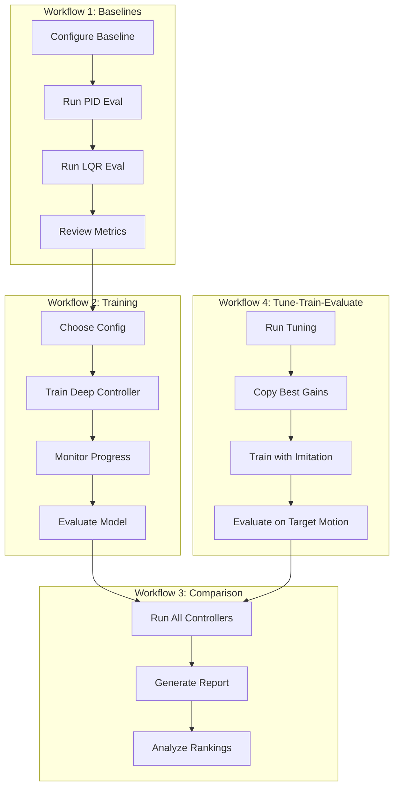

# Quadcopter Target Tracking Research

[](CHANGELOG.md)
[](https://www.python.org/downloads/)
[](LICENSE)

A Python-based research repository for quadcopter target-tracking studies with LQR and ML-based controllers.

## Project Goals

This project provides a simulation environment and controller implementations for studying quadcopter target-tracking problems. The primary objectives are:

1. **Evaluate classical control methods** (LQR, PID) for target tracking
2. **Train and compare learning-based approaches** using deep reinforcement learning
3. **Establish reproducible benchmarks** for tracking performance
4. **Document research findings** systematically

## Assumptions

The current implementation makes the following simplifying assumptions:

- **Perfect target information**: The quadcopter has exact knowledge of target position and velocity (no sensor noise)
- **Smooth target motion**: Target trajectories are differentiable and continuous
- **Idealized dynamics**: Simplified quadcopter model without disturbances
- **3D tracking**: Full spatial tracking problem in three dimensions

These assumptions will be relaxed in future iterations as the research progresses.

## Success Criteria

A tracking episode is considered **successful** when:

| Metric | Threshold |
|--------|-----------|
| Episode duration | ≥ 30 seconds |
| On-target ratio | ≥ 80% |
| Target radius | ≤ 0.5 meters |

**Definition**: The quadcopter is "on-target" when its position is within 0.5 meters of the target position. Success requires maintaining this proximity for at least 80% of episodes lasting 30 seconds or more.

## Installation

### Requirements
- Python 3.10+
- Linux (recommended), macOS, or Windows

### Setup

```bash
# Clone the repository
git clone https://github.com/AgentFoundryExamples/lqr-quadcopter-test.git
cd lqr-quadcopter-test

# Install with dependencies
make install

# Or install with development dependencies
make dev-install
```

### GPU Support

PyTorch is included for future ML-based controllers. For GPU support:
- Install CUDA toolkit (11.8+ recommended)
- PyTorch will automatically use GPU if available

For CPU-only machines:
- No additional setup required
- Set `CUDA_VISIBLE_DEVICES=""` to force CPU usage

## Quick Start

### Run an Experiment

```bash
# Run with default configuration
make run-experiment

# Run with custom seed
make run-experiment SEED=123

# Run with custom config file
make run-experiment CONFIG=configs/circular.yaml
```

### Riccati-LQR Quick Start

The Riccati-LQR controller provides mathematically optimal feedback gains by solving the discrete-time algebraic Riccati equation (DARE). This is the recommended controller for research baselines and imitation learning.

```bash
# Evaluate Riccati-LQR with default gains
python -m quadcopter_tracking.eval --controller riccati_lqr --episodes 10

# Tune Riccati-LQR Q/R weights for your motion pattern
make tune-riccati-linear TUNING_ITERATIONS=30

# Use tuned Riccati-LQR as teacher for imitation learning
python -m quadcopter_tracking.train --config experiments/configs/training_imitation.yaml
```

See [Controller Auto-Tuning](#controller-auto-tuning) for detailed tuning guidance.

### Tune → Train → Evaluate Checklist

Use this checklist for end-to-end controller development:

1. **Establish baseline**: `make eval-baseline-stationary EPISODES=10`
2. **Tune controller gains**: `make tune-riccati-linear TUNING_ITERATIONS=50`
3. **Review tuning results**: `cat reports/tuning/*_best_config.json`
4. **Update training config**: Copy best gains to `experiments/configs/training_imitation.yaml`
5. **Train deep controller**: `python -m quadcopter_tracking.train --config experiments/configs/training_imitation.yaml`
6. **Evaluate trained model**: `make eval-baseline-linear EPISODES=10`
7. **Compare controllers**: `make compare-controllers EPISODES=10`

> **Tip:** For detailed workflow instructions, see [Workflow 4: Tune → Train → Evaluate Pipeline](#workflow-4-tune--train--evaluate-pipeline).

### Configuration

Copy the example environment file and customize:

```bash
cp .env.example .env
# Edit .env with your preferred settings
```

Key configuration parameters:
- `QUADCOPTER_SEED`: Random seed for reproducibility
- `QUADCOPTER_EPISODE_LENGTH`: Duration of tracking episodes (seconds)
- `QUADCOPTER_TARGET_RADIUS`: On-target threshold (meters)
- `QUADCOPTER_TARGET_MOTION_TYPE`: Target motion pattern (stationary (default), linear, circular, sinusoidal)

See [.env.example](.env.example) for all available options.

## Project Structure

```
├── src/
│   ├── env/           # Environment simulation
│   ├── controllers/   # Controller implementations (LQR, PID, Neural)
│   ├── utils/         # Shared utilities and loss functions
│   └── train.py       # Deep learning training script
├── experiments/
│   └── configs/       # Training configuration files
├── docs/              # Documentation
│   ├── architecture.md
│   ├── environment.md
│   └── training.md
├── tests/             # Test suite
├── pyproject.toml     # Python package configuration
├── Makefile           # CLI commands
├── .env.example       # Environment variable template
└── README.md          # This file
```

See [docs/architecture.md](docs/architecture.md) for detailed architecture documentation.

## Environment Usage

The simulation environment provides a realistic quadcopter dynamics model with target tracking capabilities.

### Basic Example

```python
from quadcopter_tracking.env import QuadcopterEnv

# Create environment
env = QuadcopterEnv()
obs = env.reset(seed=42)

# Run simulation
done = False
while not done:
    # Get state information
    quad_pos = obs["quadcopter"]["position"]
    target_pos = obs["target"]["position"]
    
    # Compute control action
    error = target_pos - quad_pos
    action = {
        "thrust": 9.81 + error[2] * 2.0,
        "roll_rate": error[1] * 0.5,
        "pitch_rate": -error[0] * 0.5,
        "yaw_rate": 0.0,
    }
    
    obs, reward, done, info = env.step(action)

print(f"Success: {info['success']}")
print(f"On-target ratio: {info['on_target_ratio']:.1%}")
```

### State Vector

| Component | Variables | Units |
|-----------|-----------|-------|
| Position | x, y, z | meters |
| Velocity | vx, vy, vz | m/s |
| Attitude | roll, pitch, yaw | radians |
| Angular rate | p, q, r | rad/s |

### Target Motion Patterns

- **stationary**: Fixed position (hover reference) - **default**
- **linear**: Constant velocity in random direction
- **circular**: Orbital motion in horizontal plane
- **sinusoidal**: Multi-axis oscillation
- **figure8**: Lemniscate trajectory

### Physics Parameters

Controllers (PID/LQR) receive quadcopter physics parameters for computing hover thrust:

| Parameter | Default | Description |
|-----------|---------|-------------|
| mass | 1.0 kg | Quadcopter mass |
| gravity | 9.81 m/s² | Gravitational acceleration |

These values are surfaced from the environment configuration to controller constructors, enabling proper hover thrust calculation (`hover_thrust = mass × gravity`).

**Hover Thrust Baseline:** Both PID and LQR controllers output absolute thrust values that include the hover feedforward term. At zero tracking error (quadcopter at target position with matching velocity), controllers output `hover_thrust` (~9.81 N with default mass/gravity). This ensures training data contains meaningful thrust values suitable for learning gravity compensation.

### Optional Feedforward Support

Both PID and LQR controllers support optional velocity and acceleration feedforward for improved tracking of moving targets. **Feedforward is disabled by default** to preserve baseline behavior.

**When to enable feedforward:**
- Tracking moving targets (linear, circular, sinusoidal motion)
- Reducing phase lag behind high-speed targets

**Configuration example:**

```yaml
pid:
  feedforward_enabled: true
  ff_velocity_gain: [0.1, 0.1, 0.1]
  ff_acceleration_gain: [0.05, 0.05, 0.0]
```

See [docs/architecture.md](docs/architecture.md#feedforward-support-optional) for detailed tuning guidance.

### Default Controller Gains

The default PID and LQR gains are experimentally validated for stable tracking across stationary, linear, and circular target scenarios:

| Controller | XY Gains | Z Gains | Rationale |
|------------|----------|---------|-----------|
| PID kp_pos | 0.01 | 4.0 | Low XY to prevent saturation |
| PID ki_pos | 0.0 | 0.0 | Zero to avoid wind-up |
| PID kd_pos | 0.06 | 2.0 | Low XY damping |
| LQR q_pos | 0.0001 | 16.0 | Low XY position cost |
| LQR q_vel | 0.0036 | 4.0 | Velocity damping |

**Why are XY gains so small?** Position errors in meters are mapped directly to angular rates in rad/s. With the old gains (kp=2.0), a 1-meter XY error would produce 2 rad/s of pitch/roll rate—enough to saturate actuators and cause instability. The new gains (kp=0.01) produce only 0.01 rad/s per meter of error, ensuring stable convergence without saturation.

**Integral term:** The integral gains default to zero for XY axes to avoid wind-up. Users can tune these for bias rejection if needed, but the default provides stable tracking for most scenarios.

See [docs/architecture.md](docs/architecture.md) for detailed gain tuning guidance.

### Controller Configuration via YAML/CLI

Controller-specific settings can be configured via YAML files or CLI arguments. Both training and evaluation pipelines parse controller_config sections from experiment YAML files.

The `controller` key in YAML files specifies the controller type. For `eval.py`, the `--controller` CLI argument takes precedence over the config file if both are provided.

**YAML Configuration Example:**

```yaml
# experiments/configs/my_experiment.yaml
controller: riccati_lqr  # Options: 'deep', 'lqr', 'riccati_lqr', 'pid'

# PID controller gains (used when controller=pid)
pid:
  kp_pos: [0.02, 0.02, 5.0]
  ki_pos: [0.0, 0.0, 0.0]
  kd_pos: [0.08, 0.08, 2.5]
  integral_limit: 0.0

# LQR controller weights (used when controller=lqr)
lqr:
  q_pos: [0.001, 0.001, 20.0]
  q_vel: [0.01, 0.01, 5.0]
  r_thrust: 1.0
  r_rate: 1.0

# Riccati-LQR controller (used when controller=riccati_lqr)
# Solves DARE for optimal feedback gains with same schema as PID/LQR
riccati_lqr:
  dt: 0.01                          # Simulation timestep (required)
  mass: 1.0                         # Quadcopter mass (kg)
  gravity: 9.81                     # Gravitational acceleration (m/s²)
  q_pos: [0.0001, 0.0001, 16.0]     # Position cost weights [x, y, z]
  q_vel: [0.0036, 0.0036, 4.0]      # Velocity cost weights [vx, vy, vz]
  r_controls: [1.0, 1.0, 1.0, 1.0]  # Control cost [thrust, roll, pitch, yaw]
  max_thrust: 20.0                  # Output limit (N)
  min_thrust: 0.0                   # Output limit (N)
  max_rate: 3.0                     # Output limit (rad/s)
  fallback_on_failure: true         # Fall back to heuristic LQR on solver failure
```

**Using with training:**

```bash
python -m quadcopter_tracking.train --config experiments/configs/my_experiment.yaml
```

**Using with evaluation:**

```bash
# Use controller type from config file
python -m quadcopter_tracking.eval --config experiments/configs/eval_riccati_lqr_baseline.yaml

# Override controller type via CLI
python -m quadcopter_tracking.eval --controller pid --config experiments/configs/eval_stationary_baseline.yaml
```

### Environment Configuration

```python
from quadcopter_tracking.env import QuadcopterEnv, EnvConfig

config = EnvConfig()
config.target.motion_type = "circular"
config.target.radius = 3.0
config.simulation.max_episode_time = 60.0

env = QuadcopterEnv(config=config)
```

See [docs/environment.md](docs/environment.md) for complete documentation.

## Training Deep Learning Controllers

The project includes a complete training pipeline for neural network controllers
and evaluation pipelines for all controller types (deep, PID, LQR).

### Controller Selection

The `--controller` flag lets you choose between different controller types:
- `deep`: Neural network controller (requires training)
- `pid`: PID controller (classical, no training required)
- `lqr`: LQR controller (classical, heuristic gains, no training required)
- `riccati_lqr`: Riccati-LQR controller (optimal DARE-solved gains, requires scipy)

### Quick Start Training

```bash
# Train deep controller with default configuration
python -m quadcopter_tracking.train --controller deep --epochs 100 --seed 42

# Run PID controller evaluation (no training)
python -m quadcopter_tracking.train --controller pid --epochs 10

# Run LQR controller evaluation (no training)
python -m quadcopter_tracking.train --controller lqr --epochs 10

# Run Riccati-LQR controller evaluation (no training)
python -m quadcopter_tracking.train --controller riccati_lqr --epochs 10

# Train with config file
python -m quadcopter_tracking.train --config experiments/configs/training_default.yaml

# Resume deep training from checkpoint
python -m quadcopter_tracking.train --controller deep --resume checkpoints/train_xxx_epoch0050.pt
```

### Using Makefile Commands

```bash
# Train deep controller
make train-deep EPOCHS=100 SEED=42

# Run PID evaluation
make train-pid EPOCHS=10

# Run LQR evaluation
make train-lqr EPOCHS=10

# Run Riccati-LQR evaluation
make train-riccati-lqr EPOCHS=10
```

### Training Configuration

Configure training via YAML files or command line:

```bash
python -m quadcopter_tracking.train \
    --controller deep \
    --epochs 200 \
    --lr 0.001 \
    --hidden-sizes 128 128 \
    --motion-type circular \
    --checkpoint-dir checkpoints/my_experiment
```

See example configurations in `experiments/configs/`:
- `training_default.yaml`: Standard training setup
- `training_fast.yaml`: Quick testing configuration
- `training_large.yaml`: Extended training with larger network
- `diagnostics_stationary.yaml`: Diagnostic run with stationary target
- `diagnostics_linear.yaml`: Diagnostic run with linear target

### Training Diagnostics

Enable training diagnostics to analyze behavior and troubleshoot issues:

```bash
# Enable diagnostics via command line
python -m quadcopter_tracking.train \
    --controller deep \
    --epochs 50 \
    --diagnostics \
    --diagnostics-log-interval 1

# Or use a diagnostic config file
python -m quadcopter_tracking.train --config experiments/configs/diagnostics_stationary.yaml
```

Diagnostics output includes:
- Step-level observations, actions, and gradient statistics
- Epoch-level aggregated metrics
- Trajectory plots (loss, tracking error, gradient norms, on-target ratio)
- Summary with identified issues

See [docs/training.md](docs/training.md#training-diagnostics) for complete diagnostics documentation.

### Using Trained Controllers

```python
from quadcopter_tracking.controllers import DeepTrackingPolicy
from quadcopter_tracking.env import QuadcopterEnv

# Load trained controller
controller = DeepTrackingPolicy(config={
    "checkpoint_path": "checkpoints/best_model.pt"
})

# Run in environment
env = QuadcopterEnv()
obs = env.reset(seed=42)

done = False
while not done:
    action = controller.compute_action(obs)
    obs, reward, done, info = env.step(action)

print(f"On-target ratio: {info['on_target_ratio']:.1%}")
```

See [docs/training.md](docs/training.md) for complete training documentation.

## Controller Auto-Tuning

The auto-tuning feature provides automated PID, LQR, and Riccati-LQR gain
optimization by searching through parameter space to find configurations that
minimize tracking error.

### Quick Start

```bash
# Basic PID auto-tuning with sensible defaults
python scripts/controller_autotune.py --controller pid --max-iterations 50

# Grid search with 3 points per dimension
python scripts/controller_autotune.py --controller pid --strategy grid

# LQR auto-tuning
python scripts/controller_autotune.py --controller lqr --max-iterations 30

# Riccati-LQR auto-tuning (DARE-solved optimal gains)
python scripts/controller_autotune.py --controller riccati_lqr --max-iterations 30
```

### Custom Search Ranges

```bash
# PID custom ranges
python scripts/controller_autotune.py --controller pid \
    --kp-range 0.005,0.005,2.0 0.05,0.05,6.0 \
    --kd-range 0.02,0.02,1.0 0.15,0.15,3.0

# Riccati-LQR Q/R cost weight ranges
python scripts/controller_autotune.py --controller riccati_lqr \
    --q-pos-range 0.00005,0.00005,10.0 0.0005,0.0005,25.0 \
    --r-controls-range 0.5,0.5,0.5,0.5 2.0,2.0,2.0,2.0
```

### Features

- **Grid and random search strategies**
- **Deterministic seeding** for reproducible results
- **Graceful interruption** with partial results saved
- **Resume capability** from previous runs
- **Feedforward gain tuning** (optional)
- **Riccati-LQR support** with Q/R matrix tuning
- **Configurable via environment variable** (`TUNING_OUTPUT_DIR`)

### Output

Tuning results are saved to `reports/tuning/` by default:
- `tuning_pid_*_results.json` - Full results with all configurations
- `tuning_pid_*_best_config.json` - Best configuration for easy loading

See [docs/training.md](docs/training.md#pid-auto-tuning) for complete
auto-tuning documentation including [Riccati-LQR tuning](docs/training.md#riccati-lqr-auto-tuning).

## Evaluating Controllers

The evaluation pipeline assesses controller performance against success criteria.

### Quick Start Evaluation

```bash
# Evaluate a trained deep learning controller
python -m quadcopter_tracking.eval --controller deep --checkpoint checkpoints/best.pt --episodes 10

# Evaluate PID controller
python -m quadcopter_tracking.eval --controller pid --episodes 10

# Evaluate LQR controller
python -m quadcopter_tracking.eval --controller lqr --episodes 10

# Evaluate with specific motion type
python -m quadcopter_tracking.eval \
    --controller deep \
    --checkpoint checkpoints/model.pt \
    --motion-type circular \
    --episodes 20
```

### Using Makefile Commands

```bash
# Evaluate different controllers
make eval-deep EPISODES=10
make eval-pid EPISODES=10
make eval-lqr EPISODES=10
```

### Success Criteria

| Metric | Threshold |
|--------|-----------|
| Episode Duration | ≥ 30 seconds |
| On-Target Ratio | ≥ 80% |
| Target Radius | ≤ 0.5 meters |

### Output

Evaluation generates:
- `reports/metrics.json` - Detailed metrics
- `reports/plots/position_tracking_best.png` - Best episode trajectory visualization
- `reports/plots/tracking_error_best.png` - Best episode error analysis
- `reports/plots/*_worst.png` - Worst episode plots (if different from best)

See [docs/results.md](docs/results.md) for complete evaluation documentation.

## Development

```bash
# Run tests
make test

# Run linter
make lint

# Auto-format code
make format

# Clean build artifacts
make clean
```

### Hover Verification Tests

The test suite includes hover thrust integration tests that verify PID and LQR controllers output correct hover thrust (~9.81N for default mass/gravity) when the quadcopter is at the target with zero velocity.

```bash
# Run all hover thrust integration tests
python -m pytest tests/test_env_dynamics.py::TestHoverThrustIntegration -v

# Run specific hover tests
python -m pytest tests/test_env_dynamics.py::TestHoverThrustIntegration::test_pid_hover_thrust_integration -v
python -m pytest tests/test_env_dynamics.py::TestHoverThrustIntegration::test_lqr_hover_thrust_integration -v

# Run parametrized tests for different mass/gravity configurations
python -m pytest tests/test_env_dynamics.py::TestHoverThrustIntegration -v -k "parametrized"
```

The hover tests verify:
- **Thrust accuracy**: Within 0.5N of expected `hover_thrust = mass × gravity`
- **No unintended torques**: Roll, pitch, and yaw rates are ~0 at hover equilibrium
- **Regression guards**: Tests fail loudly if controllers output near-zero thrust
- **Stability**: Thrust remains stable over multiple timesteps at hover

Tests are deterministic and fast (<1s each), suitable for CI integration.

## Workflow Overview

1. **Configure**: Set experiment parameters via `.env` or config file
2. **Train**: Train controllers with `python -m quadcopter_tracking.train`
3. **Evaluate**: Assess performance with `python -m quadcopter_tracking.eval`
4. **Analyze**: Review metrics in `reports/` and generated plots
5. **Iterate**: Modify controllers or parameters and repeat

## Reproducible Workflows (v0.2)

This section describes three documented workflows for reproducible experiments.

### Workflow 1: Baseline PID/LQR Evaluation

Evaluate classical controllers to establish performance baselines.

```bash
# Quick baseline evaluation on stationary target
make eval-baseline-stationary EPISODES=10

# Baseline evaluation on circular motion
make eval-baseline-circular EPISODES=10

# Baseline evaluation on linear motion (includes Riccati-LQR)
make eval-baseline-linear EPISODES=10

# Or run individually with custom parameters
python -m quadcopter_tracking.eval \
    --controller pid \
    --motion-type circular \
    --episodes 10 \
    --seed 42 \
    --output-dir reports/baseline_pid

python -m quadcopter_tracking.eval \
    --controller lqr \
    --motion-type circular \
    --episodes 10 \
    --seed 42 \
    --output-dir reports/baseline_lqr
```

**Configuration files:**
- `experiments/configs/eval_stationary_baseline.yaml` - Stationary target baseline
- `experiments/configs/eval_circular_baseline.yaml` - Circular motion baseline
- `experiments/configs/eval_linear_baseline.yaml` - Linear motion baseline

**Expected results:**
- PID/LQR should achieve >80% on-target ratio on stationary targets
- Linear motion: expect 70-90% on-target ratio
- Circular motion: expect 70-90% on-target ratio

### Workflow 2: Deep Controller Training

Train a neural network controller and compare to baselines.

```bash
# Step 1: Start with fast config for testing
python -m quadcopter_tracking.train --config experiments/configs/training_fast.yaml

# Step 2: Full training with default config
python -m quadcopter_tracking.train --config experiments/configs/training_default.yaml

# Step 3: Evaluate trained model
python -m quadcopter_tracking.eval \
    --controller deep \
    --checkpoint checkpoints/train_*_best.pt \
    --episodes 10

# Or use Makefile
make train-deep EPOCHS=100 SEED=42
make eval-deep EPISODES=10
```

**Configuration files:**
- `experiments/configs/training_fast.yaml` - Quick testing (20 epochs)
- `experiments/configs/training_default.yaml` - Standard training (100 epochs)
- `experiments/configs/training_large.yaml` - Extended training (500 epochs)
- `experiments/configs/training_imitation.yaml` - Imitation learning from PID/LQR

**Note:** The deep controller training has known regression issues (see [docs/results.md](docs/results.md#training-diagnostics-results)). PID and LQR are recommended for production use.

### Workflow 3: Controller Comparison

Compare multiple controllers with standardized metrics.

```bash
# Step 1: Run comparison evaluation
make compare-controllers EPISODES=10 MOTION_TYPE=circular

# Step 2: Generate comparison report
make generate-comparison-report

# Step 3: View results
cat reports/comparison/comparison_summary.json
```

**Configuration file:**
- `experiments/configs/comparison_default.yaml` - Side-by-side controller comparison

**Output:**
- `reports/comparison/<controller>/metrics.json` - Per-controller metrics
- `reports/comparison/<controller>/plots/*.png` - Visualization plots
- `reports/comparison/comparison_summary.json` - Ranked comparison

### Workflow 4: Tune → Train → Evaluate Pipeline

This workflow chains tuning, training, and evaluation for optimal controller performance on moving targets.

```bash
# Step 1: Tune controller gains for linear motion
make tune-pid-linear TUNING_ITERATIONS=50

# Step 2: Copy best gains to training config
# View best config: cat reports/tuning/*_best_config.json
# Then manually copy gains to experiments/configs/training_imitation.yaml

# Step 3: Train deep controller using tuned PID as supervisor
python -m quadcopter_tracking.train \
    --config experiments/configs/training_imitation.yaml

# Step 4: Evaluate trained model on linear motion
make eval-baseline-linear EPISODES=10

# Or evaluate with specific checkpoint
python -m quadcopter_tracking.eval \
    --controller deep \
    --checkpoint checkpoints/imitation/train_*_best.pt \
    --config experiments/configs/eval_linear_baseline.yaml
```

**Tuning Makefile targets:**
- `make tune-pid-linear` - Tune PID gains for linear motion
- `make tune-lqr-linear` - Tune LQR weights for linear motion
- `make tune-riccati-linear` - Tune Riccati-LQR for linear motion

**Configuration files:**
- `experiments/configs/tuning_pid_linear.yaml` - PID tuning for linear motion
- `experiments/configs/tuning_lqr_linear.yaml` - LQR tuning for linear motion
- `experiments/configs/tuning_riccati_linear.yaml` - Riccati-LQR tuning for linear motion
- `experiments/configs/eval_linear_baseline.yaml` - Linear motion evaluation

**For other motion patterns** (circular, sinusoidal, figure8):
1. Copy the `tuning_*_linear.yaml` config
2. Change `target_motion_type` to desired pattern
3. Run with `--config path/to/your/config.yaml`

**Resource-limited machines:**
Reduce tuning iterations and evaluation episodes:
```bash
make tune-pid-linear TUNING_ITERATIONS=20 EPISODES=3
```
Or edit the config file to reduce `evaluation_horizon` and `episode_length`.

### Workflow Diagram



## System Dependencies

Most dependencies are pure Python. If you encounter issues:

### Headless Linux
```bash
# For matplotlib rendering
apt install libgl1-mesa-glx
export MPLBACKEND=Agg
```

### Missing Environment Variables
The configuration system falls back to sensible defaults. See [.env.example](.env.example) for all variables and their defaults.

### Low-Resource Machines

For machines without GPU or with limited RAM:

```bash
# Use fast config with reduced workload
python -m quadcopter_tracking.train --config experiments/configs/training_fast.yaml

# Or set environment variables
export CUDA_VISIBLE_DEVICES=""  # Force CPU
python -m quadcopter_tracking.train \
    --epochs 20 \
    --batch-size 8 \
    --episodes-per-epoch 3
```

See [docs/training.md](docs/training.md#low-resource--cpu-only-training) for detailed low-resource guidance.

## Troubleshooting

### Riccati-LQR Issues

**DARE Solver Fails / Falls Back to Heuristic LQR**

The Riccati controller may fail to solve the DARE equation if the Q/R matrices are ill-conditioned:

```bash
# Check if fallback was triggered
grep "Using fallback" reports/*.log
```

**Solutions:**
- Ensure Q matrix is positive semi-definite (all eigenvalues ≥ 0)
- Ensure R matrix is positive definite (all eigenvalues > 0)
- Keep XY position costs small: `q_pos[x,y] < 0.001`
- Validate matrices programmatically:

```python
from quadcopter_tracking.controllers import RiccatiLQRController

controller = RiccatiLQRController(config={"dt": 0.01, "fallback_on_failure": True})
if controller.is_using_fallback():
    print("Warning: DARE solver failed, using heuristic gains")
```

### Tuning Issues

**Tuning Returns Empty or Poor Results**

1. **Check tuning completed**: Verify `reports/tuning/*_results.json` exists and contains iterations
2. **Interrupt recovery**: Tuning saves partial results on Ctrl+C - resume with `--resume`
3. **Insufficient iterations**: Increase `TUNING_ITERATIONS` for better coverage
4. **Narrow search range**: Widen parameter ranges if all results are similar

```bash
# Resume interrupted tuning
python scripts/controller_autotune.py \
    --resume reports/tuning/tuning_pid_*_results.json \
    --max-iterations 100
```

**Long Tuning Runs**

For resource-limited machines:

```bash
# Reduce evaluation load per configuration
make tune-pid-linear TUNING_ITERATIONS=20

# Or edit config to reduce evaluation_episodes and episode_length
```

### Coordinate Frame and Sign Conventions

**Controller Outputs Wrong Direction**

If the quadcopter moves opposite to the target:

1. **Verify coordinate frame**: This project uses ENU (East-North-Up)
2. **Check roll/Y sign**: +roll_rate → −Y velocity (correct for ENU)
3. **Review axis mapping**: +X error → +pitch_rate, +Y error → −roll_rate

See [docs/architecture.md](docs/architecture.md#coordinate-frame-and-axis-conventions) for detailed conventions.

**Integrating with Other Simulators**

When connecting to external simulators (ROS, Gazebo, etc.):

1. Identify the simulator's coordinate frame (NED vs ENU)
2. Transform observations if frame differs from ENU
3. Invert roll/pitch signs if simulator uses opposite conventions
4. Validate with small test motions before full integration

### Workflow Resumption

**Resuming Training After Interruption**

```bash
# Resume deep controller training from checkpoint
python -m quadcopter_tracking.train \
    --config experiments/configs/training_default.yaml \
    --resume checkpoints/train_*_epoch0050.pt
```

**Stale Tuning Outputs**

> ⚠️ **Warning**: Do not mix tuning results from different environment parameters (mass, gravity, dt). Gains optimized for one configuration may be unstable with different physics.

If you changed environment parameters:
1. Delete or archive old tuning results: `mv reports/tuning reports/tuning_old`
2. Re-run tuning with updated parameters
3. Verify new gains before training

### GPU and Performance

**CPU-Only Feasibility**

Training and evaluation work on CPU-only machines with reduced performance:

| Task | GPU Time | CPU Time | Notes |
|------|----------|----------|-------|
| Riccati-LQR eval (10 episodes) | ~5s | ~10s | Minimal difference |
| PID/LQR tuning (50 iterations) | ~5 min | ~15 min | Acceptable |
| Deep training (100 epochs) | ~2 min | ~15 min | Consider reducing epochs |

**Force CPU Execution**

```bash
export CUDA_VISIBLE_DEVICES=""
python -m quadcopter_tracking.eval --controller riccati_lqr
```

### Headless Server Operation

For servers without display (CI/CD, remote machines):

```bash
# Set matplotlib backend before running
export MPLBACKEND=Agg

# Skip plot generation for faster evaluation
python -m quadcopter_tracking.eval --controller pid --no-plots
```

## v0.3.0 Status and Known Limitations

**Release Date:** December 1, 2025

**New in v0.3.0:**
- ✅ Riccati-LQR controller with DARE-solved optimal feedback gains
- ✅ Controller auto-tuning framework (grid/random search)
- ✅ Feedforward support for improved moving target tracking
- ✅ Consolidated documentation for tuning workflows and baseline performance
- ✅ Environment variable documentation for controller config paths

**New in v0.2.1:**
- ✅ Hover thrust feedforward properly documented and tested for PID/LQR
- ✅ Stationary target as default motion type
- ✅ Sign convention verification tests for controller/environment compatibility
- ✅ Expected >80% on-target ratio for PID/LQR on stationary targets

**New in v0.2:**
- ✅ Training diagnostics system with step/epoch logging
- ✅ Imitation learning mode from classical controllers
- ✅ Three documented reproducible workflows
- ✅ Controller comparison framework with automated reports
- ✅ Extended configuration presets

**Implemented Features:**
- ✅ PID and LQR classical controllers with hover feedforward
- ✅ Deep learning training pipeline
- ✅ Multiple training modes (tracking, imitation, reward-weighted)
- ✅ Evaluation and comparison workflows
- ✅ Diagnostic tools for training analysis
- ✅ Cross-platform support (Linux, macOS, Windows)

**Known Limitations:**
- ⚠️ Deep controller training exhibits regression (see docs/results.md)
- ⚠️ Experiment tracking integrations (WandB, MLflow) are placeholders only
- ⚠️ Transfer learning not supported via Trainer class

**Stubs / Future Work (v0.4+):**
- 🔲 Observation noise and imperfect information
- 🔲 State estimation (Kalman filter)
- 🔲 Reinforcement learning (PPO/SAC)
- 🔲 Hardware-in-the-loop support
- 🔲 Distributed training

**Upgrading from v0.2.x:**
- No breaking changes; all v0.2.x configurations and checkpoints remain compatible
- Review the new Riccati-LQR controller if you need mathematically optimal feedback gains
- Consider using auto-tuning (`scripts/controller_autotune.py`) when customizing gains for specific scenarios
- If using custom mass/gravity values, pass them explicitly to controller constructors
- Optionally run `python -m pytest tests/test_env_dynamics.py::TestHoverThrustIntegration -v` to verify hover thrust

**Upgrading from v0.1:**
- No breaking changes; all v0.1 configurations and checkpoints remain compatible
- Review the new [Reproducible Workflows](#reproducible-workflows-v02) section for best practices
- Consider using diagnostic configurations for troubleshooting training issues

See [ROADMAP.md](ROADMAP.md) for detailed future plans and [CHANGELOG.md](CHANGELOG.md) for complete release notes.

## Future Work

The following enhancements are planned for future iterations:

### Near-term Improvements

- **Observation Noise**: Add configurable sensor noise to target position/velocity observations for more realistic scenarios
- **Disturbance Modeling**: Implement wind and turbulence effects on quadcopter dynamics
- **Additional Motion Patterns**: Add random walk, evasive, and multi-waypoint target trajectories

### Controller Enhancements

- **Model Predictive Control (MPC)**: Implement receding horizon controller for improved constraint handling
- **Reinforcement Learning**: Add PPO/SAC implementations for comparison with supervised learning
- **Adaptive Control**: Self-tuning controllers that adjust gains based on performance

### Imperfect Information

- **State Estimation**: Integrate Kalman filtering for noisy observations
- **Recurrent Networks**: LSTM/GRU-based policies for partial observability
- **Uncertainty Quantification**: Bayesian neural networks for uncertainty-aware control

### Multi-Target Scenarios

- **Target Prioritization**: Multiple targets with priority-based tracking
- **Handoff Logic**: Smooth transitions between tracking targets
- **Collision Avoidance**: Inter-quadcopter and obstacle avoidance

### Deployment Considerations

- **Real-time Execution**: Profile and optimize for embedded systems
- **Hardware-in-the-Loop**: Interface with physical quadcopter platforms
- **ROS Integration**: Publish/subscribe interfaces for robotics middleware


# Permanents (License, Contributing, Author)

Do not change any of the below sections

## License

This project is distributed under the MIT license - see the LICENSE file for details.

## Contributing

Feel free to submit issues and enhancement requests!

## Author

Created by Agent Foundry and John Brosnihan
