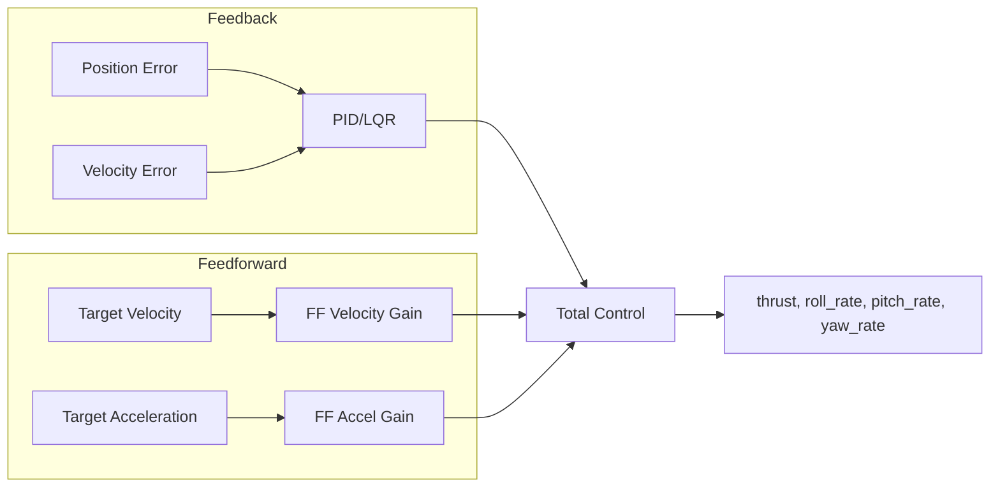
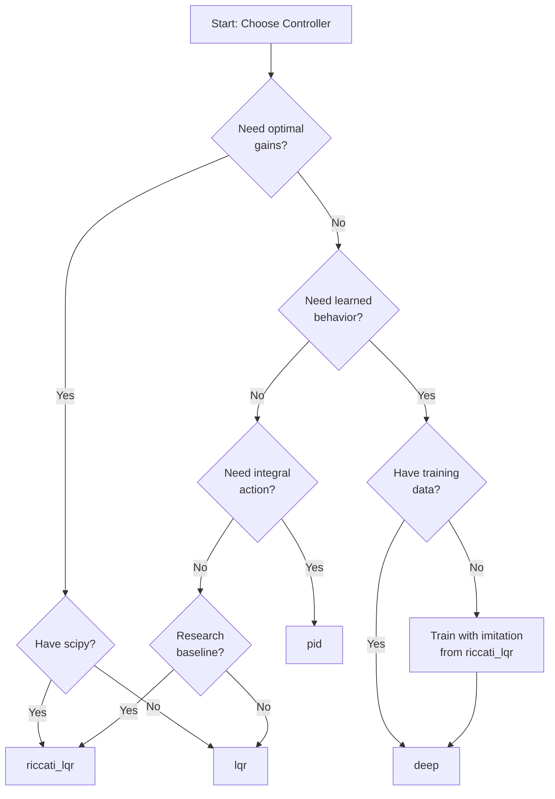

# Quadcopter Target Tracking Architecture

This document describes the architecture and design principles for the quadcopter target-tracking research repository.

## Overview

The project is structured around a clean separation between **environment simulation** and **controller implementation**, enabling:

1. Independent development and testing of controllers
2. Fair comparison across different control strategies
3. Reproducible experiments with configurable parameters

## Package Structure

```
src/
├── env/           # Environment simulation package
├── controllers/   # Controller implementations package
└── utils/         # Shared utilities package
```

### Environment Package (`src/env/`)

**Responsibility**: Simulate quadcopter dynamics, target motion, and provide observations/rewards.

The environment package owns:
- Quadcopter physics model (simplified or detailed)
- Target trajectory generation
- State observation interface
- Reward computation for tracking performance
- Episode termination logic

**Key Interfaces**:
- `reset(seed) -> observation`: Initialize episode, return initial state
- `step(action) -> (observation, reward, done, info)`: Execute action, return results

**Design Decisions**:
- Environment is the single source of truth for state
- Observations are dictionaries for flexibility
- Reward design focuses on tracking accuracy within radius threshold

### Controllers Package (`src/controllers/`)

**Responsibility**: Transform observations into control actions.

The controllers package owns:
- Control algorithm implementations (LQR, PID, neural)
- Controller-specific state (e.g., integral error for PID)
- Gain tuning interfaces

**Key Interfaces**:
- `compute_action(observation) -> action`: Main control computation
- `reset()`: Clear controller state between episodes

**Design Decisions**:
- Controllers are observation-to-action transformations
- Stateless where possible (LQR), stateful when needed (PID integral)
- Common base class for consistent interface

### Utilities Package (`src/utils/`)

**Responsibility**: Shared functionality used by both environment and controllers.

The utilities package owns:
- Configuration loading (YAML/JSON + env vars)
- Data logging for experiments
- Plotting and visualization
- Common math utilities

**Design Decisions**:
- Config loader provides defaults, file overrides, then env var overrides
- Logging captures sufficient data for post-hoc analysis
- Plotting provides standardized visualizations

## Classical Controller Pipeline

The repository provides two classical controllers (PID and LQR) that share a common pipeline for processing observations and generating control actions.

### Coordinate Frame and Axis Conventions

The environment uses a right-handed coordinate system (ENU - East-North-Up) with the following axis conventions:

| Axis | Direction | Rotation | Effect |
|------|-----------|----------|--------|
| X | Forward/East | Pitch | +pitch_rate → +X velocity |
| Y | Left/North | Roll | +roll_rate → -Y velocity |
| Z | Up | Yaw | +thrust → +Z acceleration |

**Important Sign Conventions:**
- **Positive pitch rate** produces **positive X velocity** (pitching nose up accelerates forward)
- **Positive roll rate** produces **negative Y velocity** (rolling right accelerates left)
- **Positive thrust** produces **positive Z acceleration** (upward force)

Controllers use these conventions to correctly map position errors to control outputs:
- **+X error** (target ahead in X) → **+pitch_rate** output
- **+Y error** (target ahead in Y) → **-roll_rate** output
- **+Z error** (target above) → **+thrust** adjustment

These conventions are validated by regression tests in `tests/test_env_dynamics.py::TestAxisSignConventions` and `tests/test_env_dynamics.py::TestENUCoordinateFrame`.

**ENU Frame Utilities:**

The `quadcopter_tracking.utils.coordinate_frame` module provides constants, assertions, and helpers for ENU compliance:

```python
from quadcopter_tracking.utils import (
    # Constants
    AXIS_X, AXIS_Y, AXIS_Z,
    GRAVITY_DIRECTION_ENU,  # [0, 0, -1]
    PITCH_RATE_TO_X_VEL_SIGN,  # +1.0
    ROLL_RATE_TO_Y_VEL_SIGN,   # -1.0
    # Frame descriptor
    ENU_FRAME,
    get_current_frame,
    # Assertions
    assert_gravity_direction_enu,
    assert_control_signs_enu,
    assert_z_up,
    # Validation
    validate_observation_frame,
    compute_position_error_enu,
)
```

### Observation Processing

Both classical controllers extract state information from the observation dictionary:

```python
observation = {
    "quadcopter": {
        "position": [x, y, z],           # meters
        "velocity": [vx, vy, vz],        # m/s
        "attitude": [roll, pitch, yaw],  # radians
        "angular_velocity": [p, q, r],   # rad/s
    },
    "target": {
        "position": [x, y, z],           # meters
        "velocity": [vx, vy, vz],        # m/s
    },
    "time": float,                       # seconds
}
```

### Control Output Mapping

All controllers (PID, LQR, and deep) must output a dictionary with the following canonical keys:

```python
action = {
    "thrust": float,      # Total thrust in Newtons [0, max_thrust], default max: 20.0
    "roll_rate": float,   # Desired roll rate in rad/s [-max_rate, max_rate], default max: 3.0
    "pitch_rate": float,  # Desired pitch rate in rad/s [-max_rate, max_rate], default max: 3.0
    "yaw_rate": float,    # Desired yaw rate in rad/s [-max_rate, max_rate], default max: 3.0
}
```

**Action Schema Validation:**

The `BaseController` module exports validation helpers that can be used to verify action dictionaries:

```python
from quadcopter_tracking.controllers import ACTION_KEYS, validate_action, ActionLimits

# Validate action has required keys and numeric values
action = controller.compute_action(observation)
validate_action(action)  # Raises KeyError or TypeError on invalid action

# Clip action values to valid ranges
limits = ActionLimits(max_thrust=20.0, max_rate=3.0)
clipped_action = limits.clip_action(action)
```

### PID Controller Pipeline

The PID controller uses a cascaded structure for position tracking:

```
                    Position Error              PID Terms
Target Position ──┬─────────────────►  ┌─────────────────┐
                  │                    │  P: kp * error  │
Quad Position   ──┴─────►  error ────► │  I: ki * ∫error │ ──► Desired Accel
                                       │  D: kd * ḋerror │
Target Velocity ──┬─────────────────►  └─────────────────┘
                  │                            │
Quad Velocity   ──┴─────► vel_error ──────────┘

Desired Accel ──► Control Mapping ──► [thrust, roll_rate, pitch_rate, yaw_rate]
```

**Control Mapping:**
- Z-axis acceleration → thrust adjustment above hover
- X-axis acceleration → pitch rate (positive: +pitch_rate produces +X velocity)
- Y-axis acceleration → roll rate (negative: +roll_rate produces -Y velocity)
- Yaw rate → zero (no heading tracking)

**Key Features:**
- Integral windup prevention via configurable clamp
- Per-axis gain tuning (3D arrays)
- Automatic hover thrust calculation from mass/gravity
- **Optional feedforward for moving targets** (see below)

**Hover Thrust Baseline:**
The PID controller outputs `thrust = hover_thrust + correction`, where:
- `hover_thrust = mass × gravity` (e.g., 1.0 kg × 9.81 m/s² = 9.81 N)
- `correction` is the Z-axis PID term from position/velocity error

At zero tracking error (quadcopter at target with matching velocity), the PID
controller outputs exactly `hover_thrust` (~9.81 N with default parameters).
This ensures the environment receives absolute thrust values suitable for
gravity compensation, making training data usable for learning controllers.

### LQR Controller Pipeline

The LQR controller uses a pre-computed feedback gain matrix:

```
                State Error Vector (6D)
Target State ──┬──────────────────────────────────────────┐
               │                                          │
Quad State   ──┴──► [pos_error(3), vel_error(3)] ──────► │
                                                          ▼
                                            ┌─────────────────────┐
                                            │   u = K @ state     │
                                            │   K: 4x6 gain matrix│
                                            └──────────┬──────────┘
                                                       │
                                                       ▼
                              [thrust_adj, roll_rate, pitch_rate, yaw_rate]
```

**Gain Computation:**
For the linearized hover dynamics, LQR gains are computed from cost matrices:
- `Q`: State cost matrix (6x6 diagonal)
- `R`: Control cost matrix (4x4 diagonal)

The feedback law minimizes: `J = ∫(x'Qx + u'Ru) dt`

**Operating Envelope:**
The LQR linearization assumes:
- Small attitude angles (< 30 degrees from hover)
- Moderate velocities (< 5 m/s)
- Position errors up to ±10 meters

For aggressive maneuvers outside this envelope, performance degrades.

**Hover Thrust Baseline:**
Like the PID controller, LQR outputs `thrust = hover_thrust + thrust_correction`, where:
- `hover_thrust = mass × gravity` (e.g., 1.0 kg × 9.81 m/s² = 9.81 N)
- `thrust_correction` is the thrust adjustment computed as `K @ state_error` for
  the thrust row (first element of the control output vector)

At zero state error, the LQR controller outputs exactly `hover_thrust` (~9.81 N
with default parameters), providing proper gravity compensation.

### Riccati-LQR Controller Pipeline

The Riccati-LQR controller solves the discrete-time algebraic Riccati equation
(DARE) to compute mathematically optimal feedback gains. Unlike the heuristic
LQR, which uses simplified gain computations, Riccati-LQR provides a true optimal
solution for the linearized quadcopter dynamics.

```
                 Linearized System Matrices
 Physical ──► ┌────────────────────────────────┐
 Parameters   │  A, B = build_linearized_system(dt) │
              │  (6x6 state transition, 6x4 control) │
              └──────────────────┬─────────────┘
                                 │
                                 ▼
              ┌────────────────────────────────┐
              │  DARE Solver (scipy.linalg)    │
              │  P = solve_discrete_are(A,B,Q,R)│
              │  K = (R + B'PB)^{-1} B'PA       │
              └──────────────────┬─────────────┘
                                 │
                                 ▼
              ┌────────────────────────────────┐
              │  Optimal Feedback: u = K @ x   │
              │  K: 4x6 gain matrix            │
              └────────────────────────────────┘
```

**DARE Solution:**
The DARE finds the steady-state solution P to:
```
A'PA - P - A'PB(R + B'PB)^{-1}B'PA + Q = 0
```

The optimal feedback gain is then:
```
K = (R + B'PB)^{-1}B'PA
```

**System Linearization:**
The controller linearizes quadcopter dynamics around hover:
- State vector: `[x, y, z, vx, vy, vz]` (6D)
- Control vector: `[thrust_delta, roll_rate, pitch_rate, yaw_rate]` (4D)
- `thrust_delta` is the deviation from hover thrust

**Configuration:**

```yaml
riccati_lqr:
  dt: 0.01                          # Simulation timestep (required)
  q_pos: [1.0, 1.0, 10.0]           # Position cost [x, y, z]
  q_vel: [0.1, 0.1, 1.0]            # Velocity cost [vx, vy, vz]
  r_controls: [1.0, 1.0, 1.0, 1.0]  # Control cost [thrust, roll, pitch, yaw]
  fallback_on_failure: true         # Fall back to heuristic LQR on solver failure
```

**Use Cases:**
- Serving as a strong teacher for deep imitation learning
- Validating control performance against optimal baselines
- Research on LQR-based quadcopter control

**Fallback Behavior:**
If the DARE solver fails (e.g., due to ill-conditioned matrices), the controller
can fall back to the heuristic LQR with matched parameters:

```python
controller = RiccatiLQRController(config={"dt": 0.01, "fallback_on_failure": True})
if controller.is_using_fallback():
    print("Warning: Using fallback heuristic LQR")
```

**Matrix Validation:**
The controller validates input matrices:
- Q must be positive semi-definite (all eigenvalues ≥ 0)
- R must be positive definite (all eigenvalues > 0)
- Invalid matrices trigger `ValueError` (or fallback if enabled)

**Dependencies:**
- Requires `scipy>=1.11.0` for `scipy.linalg.solve_discrete_are`
- scipy is included in `pyproject.toml` dependencies

### Feedforward Support (Optional)

Both PID and LQR controllers support optional feedforward terms for improved
tracking of moving targets. Feedforward is **disabled by default** to preserve
baseline behavior and backward compatibility.



**When to Enable Feedforward:**
- Moving targets (linear, circular, sinusoidal motion)
- High-speed tracking scenarios
- Reducing phase lag behind moving targets

**When to Keep Feedforward Disabled:**
- Stationary targets (no benefit, pure feedback suffices)
- Initial tuning/debugging (simplifies analysis)
- Reproducing baseline behavior for comparison

**Configuration:**

```yaml
pid:
  feedforward_enabled: true
  ff_velocity_gain: [0.1, 0.1, 0.1]      # Scale target velocity (m/s)
  ff_acceleration_gain: [0.05, 0.05, 0.0] # Scale target acceleration (m/s²)
  ff_max_velocity: 10.0                   # Clamp velocity for noise rejection
  ff_max_acceleration: 5.0                # Clamp acceleration for noise rejection

lqr:
  feedforward_enabled: true
  ff_velocity_gain: [0.1, 0.1, 0.1]
  ff_acceleration_gain: [0.05, 0.05, 0.0]
  ff_max_velocity: 10.0
  ff_max_acceleration: 5.0
```

**Recommended Feedforward Gains:**

| Scenario | ff_velocity_gain | ff_acceleration_gain |
|----------|------------------|----------------------|
| Slow moving targets (< 1 m/s) | [0.05, 0.05, 0.05] | [0.0, 0.0, 0.0] |
| Moderate speeds (1-3 m/s) | [0.1, 0.1, 0.1] | [0.02, 0.02, 0.0] |
| Fast moving targets (> 3 m/s) | [0.15, 0.15, 0.1] | [0.05, 0.05, 0.02] |

**Notes:**
- Z-axis feedforward is typically less aggressive than XY (vertical motion limited)
- Acceleration feedforward is optional; some motion generators don't provide it
- If acceleration data is missing, the controller gracefully falls back to velocity-only
- Clamping limits (`ff_max_velocity`, `ff_max_acceleration`) prevent oscillation from noisy inputs

**Diagnostics:**

Controllers log individual control term contributions for analysis:

```python
pid = PIDController(config={"feedforward_enabled": True, ...})
pid.compute_action(observation)

# Get breakdown of P/I/D/FF terms
components = pid.get_control_components()
print(components["p_term"])             # Proportional contribution
print(components["i_term"])             # Integral contribution
print(components["d_term"])             # Derivative contribution
print(components["ff_velocity_term"])   # Velocity feedforward contribution
print(components["ff_acceleration_term"]) # Acceleration feedforward contribution
```

**Coordinate Frame Warning:**
Feedforward inputs use the same frame as target observations (ENU - East-North-Up).
When combining feedforward with auto-tuned gains, ensure the target velocity/acceleration
units match the controller's expected input scale (meters/second, meters/second²).

### Metrics and Logging Integration

Classical controllers integrate with the metrics infrastructure:

```python
from quadcopter_tracking.controllers import PIDController
from quadcopter_tracking.eval import Evaluator

# Create controller and evaluator
controller = PIDController(config={"kp_pos": [2.0, 2.0, 4.0]})
evaluator = Evaluator(controller=controller)

# Run evaluation - generates metrics and plots
summary = evaluator.evaluate(num_episodes=10)
evaluator.save_report(summary)
evaluator.generate_all_plots(summary)
```

The evaluation pipeline records:
- Tracking error at each timestep
- On-target ratio (time within target radius)
- Control effort (action magnitudes)
- Overshoot events
- Action violations (clipping events)

## Environment-Controller Separation

### Boundary Definition

```
┌─────────────────────────────────────────────────────────────────┐
│                        EXPERIMENT LOOP                          │
│                                                                 │
│   ┌─────────────┐         observation         ┌─────────────┐  │
│   │             │ ─────────────────────────▶  │             │  │
│   │ Environment │                             │ Controller  │  │
│   │             │ ◀─────────────────────────  │             │  │
│   └─────────────┘          action             └─────────────┘  │
│                                                                 │
└─────────────────────────────────────────────────────────────────┘
```

### What Crosses the Boundary

**Environment → Controller (Observation)**:
- Quadcopter position, velocity, orientation
- Target position, velocity
- Time remaining in episode

**Controller → Environment (Action)**:
- Thrust command
- Roll, pitch, yaw rate commands

### What Stays Within Each Side

**Environment Only**:
- Physics integration
- Collision detection
- Reward computation
- Random target trajectory generation

**Controller Only**:
- Control gain computation
- Reference trajectory planning
- Internal state estimation

## Configuration System

### Priority Order
1. Environment variables (highest)
2. Config file (YAML/JSON)
3. Default values (lowest)

### Key Configuration Parameters

| Parameter | Default | Description |
|-----------|---------|-------------|
| `seed` | 42 | Random seed for reproducibility |
| `episode_length` | 30.0 | Episode duration (seconds) |
| `target.radius_requirement` | 0.5 | On-target threshold (meters) |
| `target.motion_type` | linear | Target motion pattern |
| `success_criteria.min_on_target_ratio` | 0.8 | Required on-target time fraction |

### Classical Controller Configuration

Controller gains are configured via YAML. The default gains are experimentally validated for stable tracking across stationary, linear, and circular target scenarios.

**Recommended Baseline Gains:**

```yaml
# PID Controller - Validated baseline gains
# XY gains are small to prevent actuator saturation (meter→rad/s mapping)
pid:
  kp_pos: [0.01, 0.01, 4.0]   # Proportional gains [x, y, z] - low XY
  ki_pos: [0.0, 0.0, 0.0]     # Integral gains [x, y, z] - zero to avoid wind-up
  kd_pos: [0.06, 0.06, 2.0]   # Derivative gains [x, y, z] - low XY damping
  integral_limit: 0.0          # Disabled by default

# LQR Controller - Validated baseline weights
# XY costs are small to produce low feedback gains (meter→rad/s mapping)
lqr:
  q_pos: [0.0001, 0.0001, 16.0]  # Position cost weights - low XY
  q_vel: [0.0036, 0.0036, 4.0]   # Velocity cost weights
  r_thrust: 1.0                   # Thrust control cost
  r_rate: 1.0                     # Rate control cost
```

**Why are XY gains so small?**

Position errors in meters are mapped directly to angular rates in rad/s:
- A 1m XY error with kp=0.01 → 0.01 rad/s pitch/roll rate (safe)
- A 1m XY error with kp=2.0 → 2.0 rad/s pitch/roll rate (saturates actuators)

The new validated gains ensure stable convergence without actuator saturation.

**Integral Term:**

The integral gains default to zero for XY axes to avoid wind-up during transients. Users can tune these for bias rejection if steady-state error is observed:

```yaml
# Example: Adding integral for bias rejection
pid:
  ki_pos: [0.001, 0.001, 0.0]  # Small XY integral
  integral_limit: 0.1           # Tight limit to prevent wind-up
```

**Overriding Defaults:**

To use custom gains for specific scenarios, pass them in the config:

```yaml
# Example: Aggressive gains for testing (not recommended for production)
pid:
  kp_pos: [2.0, 2.0, 4.0]   # Higher XY gains
  kd_pos: [1.5, 1.5, 2.0]   # Higher XY damping
```

**Warning:** Higher XY gains may cause actuator saturation and instability. Always verify with the new gains before deploying.

## Success Criteria

A tracking episode is considered **successful** when:

1. Episode runs for at least **30 seconds**
2. Quadcopter maintains position within **0.5 meters** of target for **≥80%** of the episode

This criteria ensures:
- Controllers handle sustained tracking (not just instantaneous)
- Some tolerance for transient errors (20% off-target allowed)
- Clear, measurable benchmark for comparison

## Controller Selection Guide

Use this decision tree to choose the appropriate controller for your use case:



### Controller Comparison Matrix

| Controller | Gains | Training | Scipy Required | Best Use Case |
|------------|-------|----------|----------------|---------------|
| **PID** | Manual/tuned | No | No | Stationary targets, bias rejection |
| **LQR** | Heuristic formula | No | No | Quick prototyping, moderate speeds |
| **Riccati-LQR** | DARE-optimal | No | Yes | Research baselines, imitation teacher |
| **Deep** | Learned | Yes | No | Complex motion, nonlinear scenarios |

### When to Use Riccati-LQR

**Choose Riccati-LQR when:**
- You need mathematically optimal feedback gains
- You want a strong teacher for imitation learning
- You're establishing research baselines
- You have scipy available (included in dependencies)

**Avoid Riccati-LQR when:**
- DARE solver fails repeatedly (use LQR fallback)
- XY position costs are large (causes actuator saturation)
- Real-time embedded deployment (solver overhead)

### Controller Limitations Summary

| Controller | Key Limitations |
|------------|-----------------|
| **PID** | Oscillates on fast targets, integral windup during transients |
| **LQR** | Linearization fails for angles > 30° or velocities > 5 m/s |
| **Riccati-LQR** | DARE may fail with ill-conditioned Q/R, same linear assumptions as LQR |
| **Deep** | Requires training data, exhibits training regression (see docs/results.md) |

### Riccati-LQR Specific Limitations

The Riccati-LQR controller provides optimal gains but has specific constraints:

1. **Q/R Matrix Requirements:**
   - Q must be positive semi-definite (all eigenvalues ≥ 0)
   - R must be positive definite (all eigenvalues > 0)
   - XY costs should be small: `q_pos[x,y] < 0.001`

2. **DARE Solver Behavior:**
   - May fail for ill-conditioned matrices
   - Falls back to heuristic LQR if `fallback_on_failure: true`
   - Raises `ValueError` if fallback disabled and solver fails

3. **Linearization Assumptions:**
   - Same operating envelope as LQR (small angles, moderate velocities)
   - Gains computed around hover equilibrium
   - Performance degrades for aggressive maneuvers

4. **Timestep Dependency:**
   - `dt` parameter must match simulation timestep
   - Mismatch causes incorrect gain scaling

## Controller Comparison Guide

| Controller | Strengths | Weaknesses | Best For |
|------------|-----------|------------|----------|
| **PID** | Simple, intuitive tuning, integral eliminates steady-state error | Can oscillate, requires manual tuning | Stationary targets, slow motion |
| **LQR** | Optimal for linearized system, systematic gain design | Assumes linear dynamics, no integral action | Moderate velocities, known dynamics |
| **Riccati-LQR** | Mathematically optimal DARE solution, strong imitation teacher | Same linear assumptions as LQR, solver may fail | Research baselines, imitation learning |
| **Deep** | Can learn complex mappings, adapts to nonlinearities | Requires training data, black-box | Complex motion, nonlinear scenarios |

## Future Iteration Workflow

### Phase 1: Baseline Implementation (Current)
- Basic environment with linear target motion
- LQR controller implementation
- Validation of success criteria computation

### Phase 2: Controller Comparison
- Implement PID controller
- Run comparative experiments
- Analyze performance differences

### Phase 3: Advanced Scenarios
- Add non-linear target motion
- Introduce observation noise
- Test controller robustness

### Phase 4: Learning-Based Controllers
- Implement neural network controller
- Design training pipeline
- Compare learned vs. classical controllers

## Assumptions and Limitations

### Current Assumptions
- **Perfect state information**: No sensor noise
- **Smooth target motion**: Differentiable trajectories
- **Idealized quadcopter**: Simplified dynamics model
- **3D tracking**: Full spatial tracking problem

### Known Limitations
- No disturbance modeling (wind, etc.)
- Single target only
- No obstacle avoidance
- Deterministic environment (given seed)

### Classical Controller Limitations
- **PID**: Performance degrades for fast-moving targets; integral windup during large transients
- **LQR**: Linearization breaks down for large attitude angles (> 30°) or high velocities
- **Riccati-LQR**: DARE solver requires well-conditioned Q/R matrices; same linearization constraints as LQR

## Unified Controller Interface

Both `train.py` and `eval.py` support the `--controller` flag to select between controller types:

```bash
# Training/evaluation with different controllers
python -m quadcopter_tracking.train --controller deep --epochs 100
python -m quadcopter_tracking.train --controller pid --epochs 10
python -m quadcopter_tracking.train --controller lqr --epochs 10

python -m quadcopter_tracking.eval --controller deep --checkpoint checkpoints/model.pt
python -m quadcopter_tracking.eval --controller pid --episodes 10
python -m quadcopter_tracking.eval --controller lqr --episodes 10
python -m quadcopter_tracking.eval --controller riccati_lqr --episodes 10
```

### Controller Types

| Controller | Training | Checkpoints | Use Case |
|------------|----------|-------------|----------|
| `deep` | Yes (gradient descent) | Saved/loaded | Complex scenarios, learned behavior |
| `pid` | No (evaluation only) | None | Stationary/slow targets, tunable gains |
| `lqr` | No (evaluation only) | None | Heuristic linear control, known dynamics |
| `riccati_lqr` | No (evaluation only) | None | Optimal DARE-based control, imitation teacher |

### Configuration via YAML

Controller-specific settings are read from the YAML config file's controller_config sections. Both `train.py` and `eval.py` parse these sections and pass them to the controller constructors.

The `controller` key in the YAML file specifies which controller to use. For `eval.py`, this can be overridden by the `--controller` CLI argument (CLI takes precedence over config file).

```yaml
# experiments/configs/my_config.yaml
controller: riccati_lqr  # Options: deep, lqr, riccati_lqr, pid
epochs: 10
episodes_per_epoch: 5

# Controller-specific configuration (read when controller=pid)
pid:
  kp_pos: [0.02, 0.02, 5.0]
  ki_pos: [0.0, 0.0, 0.0]
  kd_pos: [0.08, 0.08, 2.5]
  integral_limit: 0.0
  mass: 1.0
  gravity: 9.81

# Controller-specific configuration (read when controller=lqr)
lqr:
  q_pos: [0.001, 0.001, 20.0]
  q_vel: [0.01, 0.01, 5.0]
  r_thrust: 1.0
  r_rate: 1.0

# Riccati-LQR configuration (read when controller=riccati_lqr)
# Follows the same schema as PID/LQR with gains, limits, and optional feedforward
riccati_lqr:
  dt: 0.01                        # Simulation timestep (required)
  mass: 1.0                       # Quadcopter mass (kg)
  gravity: 9.81                   # Gravitational acceleration (m/s²)
  q_pos: [0.0001, 0.0001, 16.0]   # Position cost weights [x, y, z]
  q_vel: [0.0036, 0.0036, 4.0]    # Velocity cost weights [vx, vy, vz]
  r_controls: [1.0, 1.0, 1.0, 1.0]  # Control cost [thrust, roll, pitch, yaw]
  max_thrust: 20.0                # Output limit (N)
  min_thrust: 0.0                 # Output limit (N)
  max_rate: 3.0                   # Output limit (rad/s)
  fallback_on_failure: true       # Fall back to heuristic LQR on solver failure
```

**Config Propagation:**

1. YAML file is loaded with all sections preserved
2. The full config is stored and accessible to the training/evaluation pipelines
3. When creating controllers, the pipeline reads the controller-specific section (e.g., `config['riccati_lqr']`) and passes it to the controller constructor
4. If no controller-specific section exists, the controller uses its defaults

**Usage with evaluation:**

```bash
# Eval using controller type from config file (no --controller needed)
python -m quadcopter_tracking.eval --config experiments/configs/eval_riccati_lqr_baseline.yaml

# Override controller via CLI (CLI takes precedence)
python -m quadcopter_tracking.eval --controller pid --config experiments/configs/eval_stationary_baseline.yaml
```

### Behavior Differences

For **deep** controller:
- Runs full training loop with gradient updates
- Saves checkpoints at configured intervals
- Supports checkpoint resumption via `--resume`
- Records training losses and metrics

For **classical** controllers (pid, lqr):
- Runs evaluation episodes without training
- No checkpoints saved (no trainable parameters)
- Ignores training-specific options (learning rate, optimizer, etc.)
- Records performance metrics for comparison

### Edge Cases

- **Invalid controller name**: CLI rejects with helpful error listing valid choices
- **Checkpoint with classical controller**: Warning logged, checkpoint ignored
- **Training-specific options with classical controllers**: Warning logged, options ignored
- **Missing controller_config section**: Controllers use documented defaults without error

## Development Guidelines

### Adding a New Controller
1. Create class inheriting from `BaseController`
2. Implement `compute_action()` method returning dict with canonical keys (thrust, roll_rate, pitch_rate, yaw_rate)
3. Add to `__all__` in controllers package
4. Create experiment config for new controller with controller-specific section
5. Register controller type in `train.py` and `eval.py` if trainable

### Adding Target Motion Pattern
1. Add motion type to `TargetMotion` class
2. Implement `get_position()` for new pattern
3. Document parameters in `.env.example`
4. Add config validation

### Running Experiments
```bash
# Basic experiment
make run-experiment

# Custom configuration
make run-experiment CONFIG=configs/circular.yaml SEED=123

# With environment overrides
QUADCOPTER_SEED=456 make run-experiment

# Train/evaluate different controllers
make train-deep EPOCHS=100
make train-pid EPOCHS=10
make train-lqr EPOCHS=10
make eval-pid EPISODES=20
```

### Evaluating Classical Controllers
```bash
# Evaluate PID controller
python -m quadcopter_tracking.eval --controller pid --episodes 10

# Evaluate LQR controller
python -m quadcopter_tracking.eval --controller lqr --motion-type stationary
```

## Installation Notes

### System Dependencies
The project primarily uses pure Python packages. However:
- **PyTorch**: May require CUDA toolkit for GPU support
- **Matplotlib**: Requires display backend or headless configuration

### CPU Fallback
For GPU-less machines:
- PyTorch automatically falls back to CPU
- Set `CUDA_VISIBLE_DEVICES=""` to force CPU usage
- Performance will be reduced but functionality preserved

### Common Setup Issues
- Missing `libgl1-mesa-glx` on headless Linux: `apt install libgl1-mesa-glx`
- Matplotlib display issues: Set `MPLBACKEND=Agg` for headless rendering

## Troubleshooting

### Controller Selection Issues

**Problem**: `Invalid controller type` error

**Solution**: Ensure controller name is one of: `deep`, `lqr`, `pid`. Check spelling and case.

```bash
# Correct
python -m quadcopter_tracking.train --controller pid

# Incorrect
python -m quadcopter_tracking.train --controller PID  # Wrong case
python -m quadcopter_tracking.train --controller neural  # Invalid name
```

**Problem**: Classical controller not training

**Solution**: This is expected behavior. PID and LQR controllers are classical controllers that don't require training. Use `eval.py` for evaluation or `train.py` with `--controller deep` for training.

**Problem**: Checkpoint options ignored for classical controllers

**Solution**: This is expected. Classical controllers have no trainable parameters and don't support checkpointing. Use deep controller for checkpoint functionality.

### Riccati-LQR Issues

**Problem**: DARE solver fails with "Matrix is not positive definite"

**Solution**: Validate your Q and R matrices:

```python
import numpy as np

# Check Q is positive semi-definite (eigenvalues >= 0)
q_pos = np.array([0.0001, 0.0001, 16.0])
q_vel = np.array([0.0036, 0.0036, 4.0])
Q = np.diag(np.concatenate([q_pos, q_vel]))
eigvals_Q = np.linalg.eigvalsh(Q)
print(f"Q eigenvalues: {eigvals_Q}")
print(f"Q is PSD: {all(eigvals_Q >= 0)}")

# Check R is positive definite (eigenvalues > 0)
r_controls = np.array([1.0, 1.0, 1.0, 1.0])
R = np.diag(r_controls)
eigvals_R = np.linalg.eigvalsh(R)
print(f"R eigenvalues: {eigvals_R}")
print(f"R is PD: {all(eigvals_R > 0)}")
```

Common fixes:
- Ensure all Q and R diagonal values are non-negative
- Ensure all R values are strictly positive (not zero)
- Reduce XY position costs if they're causing numerical issues

**Problem**: Riccati-LQR falls back to heuristic LQR

**Solution**: Check the log for DARE solver warnings. If fallback is acceptable, leave `fallback_on_failure: true`. For strict optimal-only mode:

```yaml
riccati_lqr:
  fallback_on_failure: false  # Will raise error instead of fallback
```

**Problem**: Riccati-LQR outputs differ from LQR

**Solution**: This is expected - Riccati-LQR computes mathematically optimal gains while heuristic LQR uses approximate formulas. The difference is more pronounced with:
- Non-unity R values
- Large Q/R ratio differences across axes
- Non-default timestep values

### Coordinate Frame Issues

**Problem**: Controller moves quadcopter in wrong direction

**Solution**: Verify coordinate frame conventions match ENU:
- +X = East/Forward, +Y = North/Left, +Z = Up
- +pitch_rate → +X velocity
- +roll_rate → −Y velocity (note negative sign)

If integrating with a simulator using NED convention:
1. Flip the sign of Y-axis position and velocity
2. Flip the sign of roll rate commands
3. Z-axis may need sign flip depending on convention
