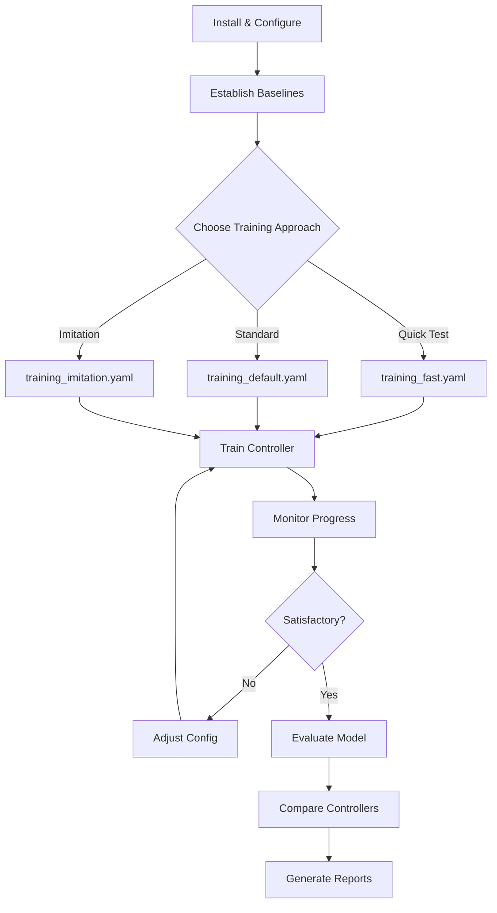
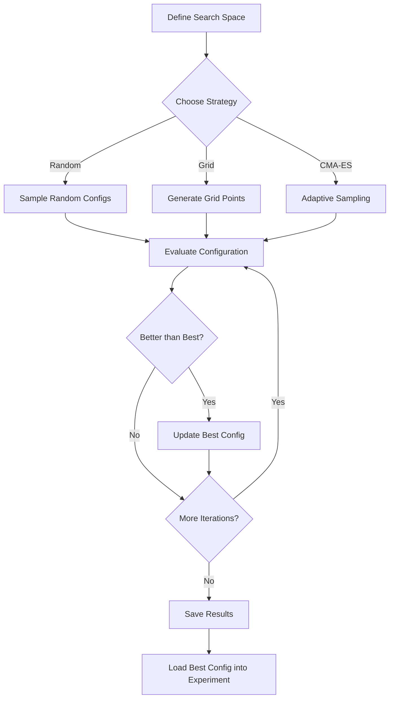

# Training Quadcopter Controllers

This document describes the training pipeline for quadcopter tracking controllers.

## Overview

The training system provides:

- **Unified CLI** supporting deep learning, PID, and LQR controllers
- **Neural network controllers** mapping observations to bounded actions
- **Classical controllers** (PID, LQR) for comparison benchmarks
- **Configurable loss functions** with various error metrics and weighting
- **Episode-based training loop** with gradient descent optimization (deep only)
- **Experiment tracking** with CSV/JSON logs and checkpointing
- **Reproducibility** via seed control and checkpoint recovery

## Step-by-Step Training Workflow

This section provides a complete walkthrough for training controllers.

### Prerequisites

1. **Install the package**:
   ```bash
   git clone https://github.com/AgentFoundryExamples/lqr-quadcopter-test.git
   cd lqr-quadcopter-test
   make dev-install
   ```

2. **Configure environment** (optional):
   ```bash
   cp .env.example .env
   # Edit .env to customize paths, seeds, or enable tracking integrations
   ```

3. **Verify installation**:
   ```bash
   make test
   ```

### Step 1: Establish Baselines (PID/LQR)

Before training a deep controller, establish baseline performance with classical controllers:

```bash
# Quick baseline evaluation
make eval-baseline-stationary EPISODES=10
make eval-baseline-circular EPISODES=10

# Or run individual evaluations
python -m quadcopter_tracking.eval --controller pid --episodes 10 --motion-type circular
python -m quadcopter_tracking.eval --controller lqr --episodes 10 --motion-type circular
```

Review the results in `reports/` to understand achievable performance targets.

### Step 2: Train Deep Controller

Choose a configuration based on your goals:

| Config File | Use Case | Training Time |
|-------------|----------|---------------|
| `training_fast.yaml` | Quick testing, debugging | ~2 minutes |
| `training_default.yaml` | Standard training | ~15 minutes |
| `training_large.yaml` | Complex tasks, best performance | ~1+ hours |
| `training_imitation.yaml` | Learning from PID/LQR supervision | ~10 minutes |

```bash
# Fast training for testing
python -m quadcopter_tracking.train --config experiments/configs/training_fast.yaml

# Standard training
python -m quadcopter_tracking.train --config experiments/configs/training_default.yaml

# Or with Makefile
make train-deep EPOCHS=100 SEED=42
```

### Step 3: Monitor Training Progress

Training creates logs in `experiments/logs/`:

```bash
# View training logs
ls experiments/logs/

# Example files created:
# train_20240101_120000_42_config.yaml  - Configuration snapshot
# train_20240101_120000_42_log.json     - Detailed metrics
# train_20240101_120000_42_log.csv      - CSV for plotting
```

For real-time monitoring with diagnostics:

```bash
python -m quadcopter_tracking.train \
    --config experiments/configs/training_default.yaml \
    --diagnostics \
    --diagnostics-log-interval 1
```

### Step 4: Evaluate Trained Model

```bash
# Evaluate the trained deep controller
python -m quadcopter_tracking.eval \
    --controller deep \
    --checkpoint checkpoints/train_YYYYMMDD_HHMMSS_42_best.pt \
    --episodes 10 \
    --motion-type circular

# Or use Makefile (uses default checkpoint path)
make eval-deep EPISODES=10
```

### Step 5: Compare Controllers

Generate a comparison report:

```bash
# Run comparison across all controllers
make compare-controllers EPISODES=10

# Generate summary report
make generate-comparison-report

# View results
cat reports/comparison/comparison_summary.json
```

### Workflow Diagram



## Controller Selection

The `--controller` flag lets you choose between controller types:

| Controller | Description | Training | Checkpoints |
|------------|-------------|----------|-------------|
| `deep` | Neural network policy (default) | Yes | Yes |
| `pid` | PID controller | No (eval only) | No |
| `lqr` | LQR controller | No (eval only) | No |

```bash
# Train deep controller
python -m quadcopter_tracking.train --controller deep --epochs 100

# Run PID evaluation (no training)
python -m quadcopter_tracking.train --controller pid --epochs 10

# Run LQR evaluation (no training)
python -m quadcopter_tracking.train --controller lqr --epochs 10
```

## Quick Start

### Train with Default Configuration

```bash
# Using make (recommended)
cd lqr-quadcopter-test
make dev-install
python -m quadcopter_tracking.train --controller deep --epochs 100 --seed 42

# Or with a config file
python -m quadcopter_tracking.train --config experiments/configs/training_default.yaml
```

### Train with Custom Parameters

```bash
python -m quadcopter_tracking.train \
    --controller deep \
    --epochs 200 \
    --lr 0.0005 \
    --hidden-sizes 128 128 64 \
    --motion-type circular \
    --checkpoint-dir checkpoints/experiment1
```

### Using Makefile Commands

```bash
# Train deep controller
make train-deep EPOCHS=100 SEED=42

# Run classical controller evaluations
make train-pid EPOCHS=10
make train-lqr EPOCHS=10
```

## Controller Architecture

### Policy Network

The `PolicyNetwork` class implements a feedforward neural network:

```
Input (18 features) → Hidden layers → Output (4 actions)
```

**Input features (18 dimensions):**
- Position error (3): target position - quadcopter position
- Velocity error (3): target velocity - quadcopter velocity
- Quadcopter attitude (3): roll, pitch, yaw
- Angular velocity (3): p, q, r
- Target position (3): absolute target position
- Target velocity (3): absolute target velocity

**Output actions (4 dimensions, bounded):**
- Thrust: [0, max_thrust] N
- Roll rate: [-max_rate, max_rate] rad/s
- Pitch rate: [-max_rate, max_rate] rad/s
- Yaw rate: [-max_rate, max_rate] rad/s

### Configurable Architecture

```python
from quadcopter_tracking.controllers import DeepTrackingPolicy

controller = DeepTrackingPolicy(config={
    "hidden_sizes": [128, 128, 64],  # Three hidden layers
    "activation": "leaky_relu",      # Options: relu, tanh, elu, leaky_relu
    "output_bounds": {
        "thrust": (0.0, 25.0),       # Custom bounds
        "roll_rate": (-5.0, 5.0),
        "pitch_rate": (-5.0, 5.0),
        "yaw_rate": (-3.0, 3.0),
    },
})
```

## Loss Functions

### Tracking Loss

The primary loss combines position error, velocity error, and control effort:

```
L_total = w_pos * L_pos + w_vel * L_vel + w_ctrl * L_ctrl
```

Where:
- `L_pos` = weighted position error norm
- `L_vel` = weighted velocity error norm
- `L_ctrl` = control effort penalty

**Error norm options:**
- `l2`: Quadratic loss (default)
- `l1`: Absolute value loss
- `huber`: Smooth transition (robust to outliers)

### Weight Matrices

Configure weight matrices for different error components:

```python
from quadcopter_tracking.utils import TrackingLoss
import numpy as np

# Emphasize z-axis tracking
pos_weight = np.diag([1.0, 1.0, 2.0])  # Higher weight on z

loss = TrackingLoss(
    position_weight=pos_weight,
    velocity_weight=0.1,
    control_weight=0.01,
    error_type="l2",
)
```

### Reward Shaping

Optional reward-based loss component for reinforcement learning:

```python
from quadcopter_tracking.utils import RewardShapingLoss

reward_loss = RewardShapingLoss(
    target_radius=0.5,      # On-target threshold
    on_target_bonus=1.0,    # Reward for being on-target
    distance_penalty=1.0,   # Penalty coefficient
    smoothing="exp",        # Options: none, exp, sigmoid
)
```

## Training Modes

The training system supports three different learning modes, configurable via YAML or command line.

### Tracking Mode (Default)

Pure tracking loss minimizes position and velocity errors without explicit supervision:

```yaml
training_mode: tracking
```

This mode uses the standard loss function:
```
L = position_weight * L_pos + velocity_weight * L_vel + control_weight * L_ctrl
```

### Imitation Mode

Imitation mode trains the policy to match actions from a classical controller (PID or LQR):

```yaml
training_mode: imitation
supervisor_controller: pid  # or lqr
imitation_weight: 2.0       # Weight for imitation loss
```

The combined loss becomes:
```
L = imitation_weight * MSE(action, supervisor_action) + tracking_weight * L_tracking
```

This mode generates supervisory signals by running the classical controller on each observation, providing clearer learning gradients than pure tracking loss.

### Reward-Weighted Mode

Reward-weighted mode uses supervisor actions as hints while maintaining tracking objectives:

```yaml
training_mode: reward_weighted
supervisor_controller: lqr
```

In this mode, the control effort penalty is computed relative to supervisor actions rather than zero, guiding the policy toward good control behaviors.

### Choosing a Training Mode

| Mode | When to Use | Pros | Cons |
|------|-------------|------|------|
| `tracking` | Baseline/research | Simple, no external dependency | May lack clear gradients |
| `imitation` | Getting started | Strong learning signal | Bounded by supervisor quality |
| `reward_weighted` | Hybrid approach | Balance flexibility/guidance | More hyperparameters |

### Configuration Example

```yaml
# experiments/configs/training_imitation.yaml
controller: deep
training_mode: imitation
supervisor_controller: pid
imitation_weight: 2.0
tracking_weight: 0.5
epochs: 50
target_motion_type: stationary
```

```bash
# Train with imitation mode via CLI
python -m quadcopter_tracking.train \
    --training-mode imitation \
    --supervisor-controller pid \
    --imitation-weight 2.0 \
    --motion-type stationary
```

## Training Configuration

### YAML Configuration File

```yaml
# experiments/configs/my_config.yaml

# Controller selection (deep, lqr, pid)
controller: deep

epochs: 200
episodes_per_epoch: 10
batch_size: 32

# Optimizer (deep controller only)
learning_rate: 0.001
optimizer: adam  # adam, sgd, adamw
weight_decay: 0.0
grad_clip: 1.0

# Network (deep controller only)
hidden_sizes: [64, 64]
activation: relu

# Loss weights
position_weight: 1.0
velocity_weight: 0.1
control_weight: 0.01
error_type: l2
tracking_weight: 1.0
reward_weight: 0.0

# Training mode configuration
training_mode: tracking  # tracking, imitation, or reward_weighted
supervisor_controller: pid  # pid or lqr (for imitation/reward_weighted)
imitation_weight: 1.0  # Weight for imitation loss

# Environment
env_seed: 42
target_motion_type: circular
episode_length: 30.0
target_radius: 0.5

# Checkpointing
checkpoint_dir: checkpoints
checkpoint_interval: 10
save_best: true

# Logging
log_dir: experiments/logs
log_interval: 1
```

### Command Line Arguments

All configuration options can be overridden via CLI:

```bash
python -m quadcopter_tracking.train \
    --config experiments/configs/training_default.yaml \
    --epochs 500 \
    --lr 0.0001 \
    --optimizer adamw \
    --hidden-sizes 128 128 \
    --motion-type figure8 \
    --seed 123
```

## Training Loop

### Episode-Based Training

1. **Reset** environment with episode-specific seed
2. **Collect** trajectory data (observations, actions, rewards)
3. **Compute** loss from batch of collected samples
4. **Update** network via gradient descent
5. **Log** metrics and save checkpoints

### Batch Processing

Training processes episodes in batches:

```python
# Each epoch
for episode in range(episodes_per_epoch):
    # Run episode, collect data
    for step in range(max_steps):
        action = controller.compute_action(obs)
        obs, reward, done, info = env.step(action)
        episode_data.append(...)
    
    # Sample batch and update
    batch = sample(episode_data, batch_size)
    loss = compute_loss(batch)
    optimizer.step()
```

## Curriculum Learning

Enable progressive difficulty for stable training:

```yaml
use_curriculum: true
curriculum_start_difficulty: 0.3
curriculum_end_difficulty: 1.0
```

Difficulty interpolates linearly from start to end over training epochs.

## Feedforward Tuning for Moving Targets

PID and LQR controllers support optional feedforward terms for improved tracking of moving targets. This section provides guidance on when and how to enable feedforward.

### When to Enable Feedforward

Enable feedforward when:
- Tracking moving targets (linear, circular, sinusoidal motion)
- Target velocity is significant (> 0.5 m/s)
- Reducing phase lag behind moving targets is important

Keep feedforward disabled when:
- Tracking stationary targets (feedforward provides no benefit)
- Initial tuning/debugging (simplifies analysis)
- Reproducing baseline behavior for comparison experiments

### Configuration

```yaml
# PID controller with feedforward enabled
pid:
  kp_pos: [0.01, 0.01, 4.0]
  ki_pos: [0.0, 0.0, 0.0]
  kd_pos: [0.06, 0.06, 2.0]
  feedforward_enabled: true
  ff_velocity_gain: [0.1, 0.1, 0.1]      # Scale target velocity
  ff_acceleration_gain: [0.05, 0.05, 0.0] # Scale target acceleration
  ff_max_velocity: 10.0                   # Clamp for noise rejection
  ff_max_acceleration: 5.0

# LQR controller with feedforward enabled
lqr:
  q_pos: [0.0001, 0.0001, 16.0]
  q_vel: [0.0036, 0.0036, 4.0]
  feedforward_enabled: true
  ff_velocity_gain: [0.1, 0.1, 0.1]
  ff_acceleration_gain: [0.0, 0.0, 0.0]  # Optional, can be zero
```

### Recommended Gain Values

| Target Speed | ff_velocity_gain | ff_acceleration_gain |
|-------------|------------------|----------------------|
| Slow (< 1 m/s) | [0.05, 0.05, 0.05] | [0.0, 0.0, 0.0] |
| Moderate (1-3 m/s) | [0.1, 0.1, 0.1] | [0.02, 0.02, 0.0] |
| Fast (> 3 m/s) | [0.15, 0.15, 0.1] | [0.05, 0.05, 0.02] |

**Tips:**
- Start with velocity feedforward only; add acceleration if needed
- Z-axis gains are typically smaller than XY (vertical motion limited)
- If acceleration data is unavailable, the controller gracefully falls back
- Use clamping limits to prevent oscillation from noisy measurements

### Diagnostics

Controllers log individual control term contributions:

```python
from quadcopter_tracking.controllers import PIDController

config = {
    "feedforward_enabled": True,
    "ff_velocity_gain": [0.1, 0.1, 0.1],
}
pid = PIDController(config=config)

# Compute action
action = pid.compute_action(observation)

# Get P/I/D/FF breakdown for analysis
components = pid.get_control_components()
print("P term:", components["p_term"])
print("I term:", components["i_term"])
print("D term:", components["d_term"])
print("FF velocity:", components["ff_velocity_term"])
print("FF accel:", components["ff_acceleration_term"])
```

### Coordinate Frame Warning

Feedforward inputs use the same frame as target observations (ENU - East-North-Up). Ensure target velocity/acceleration units match controller expectations:
- Velocity: meters/second
- Acceleration: meters/second²

When combining feedforward with auto-tuned gains, verify coordinate frames are consistent to avoid instability.

## Checkpointing and Recovery

### Automatic Checkpointing

Checkpoints are saved at configurable intervals:

```
checkpoints/
├── train_20240101_120000_42_epoch0010.pt
├── train_20240101_120000_42_epoch0020.pt
├── train_20240101_120000_42_best.pt
└── train_20240101_120000_42_final.pt
```

### Resume Training

Resume from a checkpoint:

```bash
python -m quadcopter_tracking.train \
    --config experiments/configs/training_default.yaml \
    --resume checkpoints/train_20240101_120000_42_epoch0050.pt
```

### NaN Recovery

Training automatically recovers from gradient explosion:

1. Detects NaN/Inf in loss
2. Reduces learning rate
3. Loads best checkpoint
4. Continues training

Configure recovery:

```yaml
nan_recovery_attempts: 3
lr_reduction_factor: 0.5
```

## Experiment Tracking

### Log Files

Training creates JSON and CSV logs:

```
experiments/logs/
├── train_20240101_120000_42_config.yaml
├── train_20240101_120000_42_log.json
└── train_20240101_120000_42_log.csv
```

### Logged Metrics

Each epoch records:
- `total`: Combined loss
- `position`: Position error component
- `velocity`: Velocity error component
- `control`: Control effort component
- `mean_reward`: Average episode reward
- `mean_on_target_ratio`: Time spent within target radius
- `mean_tracking_error`: Average distance to target

### Analyzing Results

```python
import json
import pandas as pd

# Load JSON log
with open("experiments/logs/train_xxx_log.json") as f:
    log = json.load(f)

# Or use CSV
df = pd.read_csv("experiments/logs/train_xxx_log.csv")
df.plot(x="epoch", y=["total", "mean_tracking_error"])
```

## Adding Alternative Controllers

### Step 1: Create Controller Class

```python
# src/quadcopter_tracking/controllers/my_controller.py
from . import BaseController

class MyController(BaseController):
    def __init__(self, config=None):
        super().__init__(name="my_controller", config=config)
        # Initialize your model
    
    def compute_action(self, observation):
        # Extract features
        quad = observation["quadcopter"]
        target = observation["target"]
        
        # Compute action
        return {
            "thrust": ...,
            "roll_rate": ...,
            "pitch_rate": ...,
            "yaw_rate": ...,
        }
```

### Step 2: Export in Package

```python
# src/quadcopter_tracking/controllers/__init__.py
from .my_controller import MyController
__all__.append("MyController")
```

### Step 3: Create Training Config

```yaml
# experiments/configs/my_controller.yaml
controller_type: my_controller
epochs: 100
# ... other parameters
```

## Hyperparameter Tuning

### Recommended Starting Points

| Parameter | Range | Notes |
|-----------|-------|-------|
| learning_rate | 1e-4 to 1e-2 | Lower for larger networks |
| hidden_sizes | [32,32] to [256,256,128] | Match task complexity |
| batch_size | 16 to 128 | Larger = more stable |
| position_weight | 0.5 to 5.0 | Increase for tighter tracking |
| control_weight | 0.001 to 0.1 | Lower = more aggressive |

### Tuning Strategy

1. Start with default config
2. Run short training (20-50 epochs)
3. Check for:
   - NaN losses → reduce learning rate
   - Slow convergence → increase learning rate
   - High tracking error → increase position_weight
   - Jerky control → increase control_weight
4. Iterate and compare experiments

## GPU Training

PyTorch automatically uses GPU if available:

```bash
# Check GPU availability
python -c "import torch; print(torch.cuda.is_available())"

# Force CPU
python -m quadcopter_tracking.train --device cpu

# Specify GPU
CUDA_VISIBLE_DEVICES=0 python -m quadcopter_tracking.train
```

## Troubleshooting

### NaN Losses

- Reduce learning rate
- Enable gradient clipping: `--grad-clip 1.0`
- Try smaller network
- Check for invalid environment observations

### Poor Convergence

- Increase training epochs
- Try different optimizer (adamw often works well)
- Enable curriculum learning
- Increase batch size

### Memory Issues

- Reduce batch size
- Use smaller network
- Enable gradient checkpointing (advanced)

### Slow Training

- Reduce max_steps_per_episode
- Fewer episodes_per_epoch
- Use GPU if available
- Profile with `torch.profiler`

## Training Diagnostics

The training pipeline includes an opt-in diagnostics system for analyzing training behavior and identifying failure modes.

### Enabling Diagnostics

Enable diagnostics via command line:

```bash
python -m quadcopter_tracking.train \
    --epochs 50 \
    --diagnostics \
    --diagnostics-log-interval 1
```

Or via configuration file:

```yaml
# experiments/configs/my_config.yaml
diagnostics_enabled: true
diagnostics_log_observations: true
diagnostics_log_actions: true
diagnostics_log_gradients: true
diagnostics_log_interval: 10
diagnostics_generate_plots: true
```

### Diagnostic Output Files

When enabled, diagnostics creates the following files in `<log_dir>/diagnostics/`:

| File | Contents |
|------|----------|
| `*_step_diagnostics.json` | Per-step observation, action, loss, gradient stats |
| `*_epoch_diagnostics.json` | Aggregated per-epoch metrics |
| `*_epoch_diagnostics.csv` | CSV format for easy analysis |
| `*_diagnostics_summary.json` | Summary with identified issues |
| `*_loss_trajectory.png` | Loss over epochs plot |
| `*_error_trajectory.png` | Tracking error over epochs plot |
| `*_gradient_trajectory.png` | Gradient norm over epochs plot |
| `*_on_target_trajectory.png` | On-target ratio over epochs plot |

### Key Diagnostic Metrics

| Metric | Description | Healthy Range |
|--------|-------------|---------------|
| `mean_gradient_norm` | Gradient magnitude | 0.1 - 10.0 |
| `action_magnitude_mean` | Control output scale | Match actuator limits |
| `observation_range` | Input feature bounds | Reasonably bounded |
| `num_nan_gradients` | NaN gradient count | 0 |
| `num_inf_gradients` | Inf gradient count | 0 |

### Interpreting Diagnostics

**Gradient Norms:**
- Very small (< 1e-7): Vanishing gradients, network stuck
- Very large (> 100): Exploding gradients, reduce learning rate
- Near clip threshold: Training may be fighting gradient clipping

**Loss Trajectory:**
- Steady decrease: Healthy training
- Increasing loss: Learning rate too high or loss misaligned
- Flat loss: Network not learning, check data flow

**Action Statistics:**
- Saturated actions: Bounds too tight or network over-confident
- Very small actions: Network under-confident or initialization issue
- High variance: Unstable policy

### Example Diagnostic Config

```yaml
# experiments/configs/diagnostics_experiment.yaml
epochs: 20
episodes_per_epoch: 5
max_steps_per_episode: 500
batch_size: 16

learning_rate: 0.001
optimizer: adam
hidden_sizes: [64, 64]

target_motion_type: stationary
episode_length: 10.0

# Enable all diagnostics
diagnostics_enabled: true
diagnostics_log_observations: true
diagnostics_log_actions: true
diagnostics_log_gradients: true
diagnostics_log_interval: 1
diagnostics_generate_plots: true
```

### Programmatic Access

```python
from quadcopter_tracking.utils import Diagnostics, DiagnosticsConfig

# Create diagnostics manager
config = DiagnosticsConfig(
    enabled=True,
    log_interval=5,
    generate_plots=True,
)
diag = Diagnostics(config=config, output_dir="my_diagnostics")

# In training loop
diag.log_step(epoch=0, step=i, observation=obs, action=action, losses=losses)

# At epoch end
epoch_diag = diag.log_epoch(epoch=0, metrics=epoch_metrics)

# Save all outputs
diag.save_summary()
diag.generate_plots()
```

### Known Training Issues

Based on diagnostic analysis, the current deep controller training exhibits:

1. **Training Regression**: Loss increases after initial epochs
2. **Tracking Error Growth**: Error increases from ~50m to ~100m over training
3. **Low On-Target Ratio**: Never exceeds 15%, far below 80% target

See [docs/results.md](results.md#training-diagnostics-results) for detailed analysis and recommended remediation.

## API Reference

### DeepTrackingPolicy

```python
class DeepTrackingPolicy(BaseController):
    def __init__(self, config=None, device=None)
    def compute_action(self, observation: dict) -> dict
    def train_mode() -> None
    def eval_mode() -> None
    def get_parameters() -> list[Parameter]
    def save_checkpoint(path, metadata=None) -> None
    def load_checkpoint(path) -> dict
```

### TrainingConfig

```python
class TrainingConfig:
    epochs: int
    episodes_per_epoch: int
    learning_rate: float
    hidden_sizes: list[int]
    # ... see source for full list
    
    @classmethod
    def from_file(path) -> TrainingConfig
    def to_dict() -> dict
```

### Trainer

```python
class Trainer:
    def __init__(self, config: TrainingConfig)
    def train() -> dict  # Returns summary
    def _train_epoch() -> dict
    def _save_checkpoint(epoch, metrics, is_best=False)
```

## Extending to Alternative Controllers

### Implementing Custom Learning Algorithms

To implement alternative learning approaches (e.g., PPO, SAC, model-based RL):

1. **Create a new controller class** inheriting from `BaseController`
2. **Implement the training loop** with your algorithm
3. **Use the existing loss functions** or define custom ones

```python
from quadcopter_tracking.controllers import BaseController
from quadcopter_tracking.env import QuadcopterEnv

class CustomRLController(BaseController):
    def __init__(self, config=None):
        super().__init__(name="custom_rl", config=config)
        # Initialize your policy, value networks, etc.
    
    def compute_action(self, observation):
        # Your policy inference
        pass
    
    def train_step(self, batch):
        # Your training update
        pass
```

### Imperfect Information Controllers

Handling partial observability (e.g., with noisy sensor data) is a planned future enhancement. This will likely involve state estimation techniques like Kalman filters and recurrent neural network architectures.

See [ROADMAP.md](../ROADMAP.md) for detailed design proposals and pseudocode.

### Transfer Learning

**Current Limitation**: The Trainer class creates its own controller internally, which does not directly support transfer learning from pretrained weights.

#### Current Workaround

For inference with pretrained weights, use `DeepTrackingPolicy.load_checkpoint()`:

```python
from quadcopter_tracking.controllers import DeepTrackingPolicy

# Load pretrained weights for inference/evaluation
controller = DeepTrackingPolicy()
controller.load_checkpoint("checkpoints/pretrained.pt")

# Use controller for evaluation
from quadcopter_tracking.eval import Evaluator
evaluator = Evaluator(controller=controller)
summary = evaluator.evaluate(num_episodes=10)
```

True transfer learning support (loading pretrained weights for fine-tuning) is planned for a future release. See [ROADMAP.md](../ROADMAP.md) for the proposed API design.

## Classical Controller Tuning

This section provides guidance for tuning the PID and LQR classical controllers.

### PID Controller

The PID controller uses separate gains for each axis (X, Y, Z). The default gains are experimentally validated for stable tracking:

```python
from quadcopter_tracking.controllers import PIDController

# Validated baseline gains (default)
pid = PIDController(config={
    "kp_pos": [0.01, 0.01, 4.0],   # Proportional gains [x, y, z] - low XY
    "ki_pos": [0.0, 0.0, 0.0],     # Integral gains [x, y, z] - zero by default
    "kd_pos": [0.06, 0.06, 2.0],   # Derivative gains [x, y, z] - low XY
    "integral_limit": 0.0,         # Disabled by default
})
```

**Why are XY gains so small?** Position errors in meters are mapped directly to angular rates in rad/s. With large gains, a 1-meter error would produce 2+ rad/s of pitch/roll rate—enough to saturate actuators. The validated gains (kp=0.01) produce only 0.01 rad/s per meter, ensuring stable convergence.

#### Gain Tuning Guidelines

| Parameter | Effect of Increase | Recommended Range |
|-----------|-------------------|-------------------|
| `kp_pos[xy]` | Faster XY response, risk of saturation | 0.005 - 0.05 |
| `kp_pos[z]` | Faster altitude response | 2.0 - 6.0 |
| `ki_pos` | Eliminates steady-state error, risk of wind-up | 0.0 - 0.01 |
| `kd_pos[xy]` | More XY damping | 0.02 - 0.1 |
| `kd_pos[z]` | More altitude damping | 1.0 - 3.0 |
| `integral_limit` | Higher limit = more correction, risk of windup | 0.0 - 0.5 |

#### Tuning Strategy

1. **Start with validated baseline**: Use the defaults (kp_pos=[0.01, 0.01, 4.0])
2. **Add derivative if oscillating**: Increase `kd_pos` to reduce overshoot
3. **Add integral for bias**: If steady-state error persists, add small `ki_pos` with tight `integral_limit`
4. **Avoid large XY gains**: Keep kp_pos[xy] < 0.05 to prevent saturation

#### Common Issues

- **Actuator saturation**: Reduce XY gains (kp_pos, kd_pos)
- **Slow XY response**: Increase kp_pos[xy] cautiously (max 0.05)
- **Altitude oscillation**: Reduce kp_pos[z] or increase kd_pos[z]
- **Steady-state XY error**: Add small ki_pos[xy] with integral_limit
- **Windup (runaway after large error)**: Reduce `integral_limit`

#### Example Configurations

**Validated Baseline (recommended for all scenarios)**:
```yaml
pid:
  kp_pos: [0.01, 0.01, 4.0]
  ki_pos: [0.0, 0.0, 0.0]
  kd_pos: [0.06, 0.06, 2.0]
  integral_limit: 0.0
```

**With Bias Rejection (for steady-state error)**:
```yaml
pid:
  kp_pos: [0.01, 0.01, 4.0]
  ki_pos: [0.001, 0.001, 0.0]  # Small integral for XY
  kd_pos: [0.06, 0.06, 2.0]
  integral_limit: 0.1           # Tight limit
```

**Legacy Aggressive Gains (for ablation studies only)**:
```yaml
# WARNING: May saturate actuators - use for comparison only
pid:
  kp_pos: [2.0, 2.0, 4.0]
  ki_pos: [0.1, 0.1, 0.2]
  kd_pos: [1.5, 1.5, 2.0]
  integral_limit: 5.0
```

### LQR Controller

The LQR controller computes optimal feedback gains from cost weights:

```python
from quadcopter_tracking.controllers import LQRController

# Validated baseline weights (default)
lqr = LQRController(config={
    "q_pos": [0.0001, 0.0001, 16.0],  # Position error cost [x, y, z] - low XY
    "q_vel": [0.0036, 0.0036, 4.0],   # Velocity error cost [vx, vy, vz]
    "r_thrust": 1.0,                   # Thrust control cost
    "r_rate": 1.0,                     # Angular rate control cost
})
```

**Why are XY costs so small?** The LQR gain formula produces K_pos = sqrt(q_pos/r). With the validated weights (q_pos[xy]=0.0001, r_rate=1.0), the XY position gains are sqrt(0.0001) = 0.01, matching the PID baseline. This prevents actuator saturation from the meter→rad/s mapping.

#### Cost Weight Guidelines

| Parameter | Effect of Increase | Recommended Range |
|-----------|-------------------|-------------------|
| `q_pos[xy]` | Tighter XY tracking, risk of saturation | 0.00001 - 0.001 |
| `q_pos[z]` | Tighter altitude tracking | 4.0 - 25.0 |
| `q_vel` | More velocity damping | 0.001 - 0.01 (XY), 1.0 - 10.0 (Z) |
| `r_thrust` | Smoother thrust changes | 0.5 - 2.0 |
| `r_rate` | Smoother attitude rate changes | 0.5 - 2.0 |

#### Tuning Strategy

1. **Start with validated baseline**: Use the defaults
2. **Adjust tracking tightness**: Increase `q_pos[z]` for tighter altitude tracking
3. **Add XY damping**: Increase `q_vel[xy]` if XY is oscillatory
4. **Keep XY position costs low**: q_pos[xy] should stay < 0.001 to prevent saturation

#### Pre-computed K Matrix

For advanced users, you can provide a pre-computed feedback gain matrix:

```python
import numpy as np

# Custom 4x6 gain matrix (validated baseline produces similar gains)
K = np.array([
    [0, 0, 4.0, 0, 0, 2.0],      # Z error -> thrust
    [0, -0.01, 0, 0, -0.06, 0],  # Y error -> roll rate (negative sign)
    [0.01, 0, 0, 0.06, 0, 0],    # X error -> pitch rate
    [0, 0, 0, 0, 0, 0],          # yaw (unused)
])

lqr = LQRController(config={"K": K.tolist()})
```

#### Operating Envelope

The LQR linearization is valid for:
- Attitude angles < 30 degrees
- Velocities < 5 m/s
- Position errors < 10 m

Outside this envelope, the controller may perform poorly.

#### Legacy Cost Weights (for ablation studies)

```yaml
# WARNING: May saturate actuators - use for comparison only
lqr:
  q_pos: [10.0, 10.0, 20.0]
  q_vel: [5.0, 5.0, 10.0]
  r_thrust: 0.1
  r_rate: 1.0
```

### Comparing Controllers

Run evaluation with different controllers:

```bash
# Evaluate PID
python -m quadcopter_tracking.eval --controller pid --episodes 10 --motion-type stationary

# Evaluate LQR
python -m quadcopter_tracking.eval --controller lqr --episodes 10 --motion-type stationary

# Evaluate Deep
python -m quadcopter_tracking.eval --controller deep --checkpoint checkpoints/best.pt
```

### Configuration via YAML

Add controller configurations to your experiment YAML files:

```yaml
# experiments/configs/my_experiment.yaml

# ... other settings ...

# PID gains for this experiment
pid:
  kp_pos: [2.0, 2.0, 4.0]
  ki_pos: [0.1, 0.1, 0.2]
  kd_pos: [1.5, 1.5, 2.0]
  integral_limit: 5.0

# LQR weights for this experiment
lqr:
  q_pos: [10.0, 10.0, 20.0]
  q_vel: [5.0, 5.0, 10.0]
  r_thrust: 0.1
  r_rate: 1.0
```

## PID Auto-Tuning

The auto-tuning feature provides an automated way to find optimal PID (and
feedforward) gains by systematically searching through parameter space and
evaluating tracking performance.

### Quick Start

```bash
# Basic PID auto-tuning with random search (uses sensible defaults)
python scripts/controller_autotune.py --controller pid --max-iterations 50

# Grid search with 3 points per dimension
python scripts/controller_autotune.py --controller pid --strategy grid

# LQR auto-tuning
python scripts/controller_autotune.py --controller lqr --max-iterations 30
```

### Search Strategies

The tuner supports three search strategies:

| Strategy | Description | Use Case |
|----------|-------------|----------|
| `random` | Uniform random sampling | Fast exploration, large spaces |
| `grid` | Exhaustive grid search | Precise, smaller spaces |
| `cma_es` | CMA-ES black-box optimization | High-dimensional, complex landscapes |

### Custom Search Ranges

Specify custom gain ranges using min/max vectors for [x, y, z] axes:

```bash
# PID with custom Kp and Kd ranges
python scripts/controller_autotune.py --controller pid \
    --kp-range 0.005,0.005,2.0 0.05,0.05,6.0 \
    --kd-range 0.02,0.02,1.0 0.15,0.15,3.0

# Include feedforward tuning
python scripts/controller_autotune.py --controller pid --feedforward \
    --ff-velocity-range 0.0,0.0,0.0 0.2,0.2,0.1
```

### Evaluation Settings

Configure how each configuration is evaluated:

```bash
python scripts/controller_autotune.py \
    --controller pid \
    --episodes 10 \           # Episodes per configuration
    --episode-length 30.0 \   # Episode duration in seconds
    --motion-type circular \  # Target motion type
    --seed 42                 # Deterministic seeding
```

### Resume from Previous Run

Long tuning runs can be interrupted and resumed:

```bash
# Interrupt with Ctrl+C - partial results are saved automatically

# Resume from saved results
python scripts/controller_autotune.py \
    --resume reports/tuning/tuning_pid_20240101_120000_results.json \
    --max-iterations 100  # Continue to 100 total iterations
```

### Output Files

Tuning results are saved to the output directory (default: `reports/tuning/`):

| File | Contents |
|------|----------|
| `tuning_pid_*_results.json` | Full tuning results with all configurations |
| `tuning_pid_*_best_config.json` | Best configuration for easy loading |

### Loading Tuned Configuration

After tuning, load the best configuration into your experiments:

```python
import json
from quadcopter_tracking.controllers import PIDController

# Load tuned gains
with open("reports/tuning/tuning_pid_*_best_config.json") as f:
    best = json.load(f)

# Create controller with tuned gains
controller = PIDController(config=best["pid"])
```

Or use in a YAML config file:

```yaml
# experiments/configs/my_tuned_experiment.yaml
controller: pid
pid:
  kp_pos: [0.034, 0.042, 3.77]  # Values from tuning
  kd_pos: [0.049, 0.092, 1.13]
```

### Environment Variable

Set the output directory via environment variable:

```bash
export TUNING_OUTPUT_DIR=/path/to/custom/output
python scripts/controller_autotune.py --controller pid
```

See `.env.example` for all environment variables.

### Workflow Diagram



## CMA-ES Auto-Tuning

CMA-ES (Covariance Matrix Adaptation Evolution Strategy) is a powerful black-box
optimization algorithm for tuning controller gains. It adaptively learns the
search distribution to efficiently find optimal parameters.

### When to Use CMA-ES

| Scenario | Recommended Strategy |
|----------|---------------------|
| Quick exploration, large space | `random` |
| Small space, exact coverage | `grid` |
| High-dimensional (>3 params) | `cma_es` |
| Complex/non-convex landscape | `cma_es` |
| Unknown optimal region | `cma_es` |

### Quick Start

```bash
# CMA-ES auto-tuning for PID gains
python scripts/controller_autotune.py --controller pid --strategy cma_es --max-iterations 50

# CMA-ES with custom sigma0 (initial step size)
python scripts/controller_autotune.py --controller pid --strategy cma_es \
    --cma-sigma0 0.5 --max-iterations 100

# CMA-ES for Riccati-LQR
python scripts/controller_autotune.py --controller riccati_lqr --strategy cma_es \
    --q-pos-range 0.00005,0.00005,10.0 0.0005,0.0005,25.0

# Using YAML configuration
python scripts/controller_autotune.py --config experiments/configs/tuning_cma_es.yaml
```

### CMA-ES Parameters

| Parameter | CLI Flag | Description | Default |
|-----------|----------|-------------|---------|
| `cma_sigma0` | `--cma-sigma0` | Initial standard deviation (fraction of range) | 0.3 |
| `cma_popsize` | `--cma-popsize` | Population size (solutions per generation) | auto |

**Sigma0 guidance:**
- Lower values (0.1-0.2): More local search, faster convergence if near optimum
- Higher values (0.3-0.5): More exploration, better for unknown landscapes
- Default (0.3): Balanced exploration/exploitation

**Population size guidance:**
- Default: Auto-calculated as `4 + floor(3*ln(n))` where n is dimension
- Increase for noisy objectives or harder problems
- Minimum: 4 (for very small dimensions)

### Evaluation Budget

CMA-ES requires more evaluations than random search for proper convergence:

| Dimension (n) | Minimum | Recommended |
|---------------|---------|-------------|
| 3 params | 30 | 90 |
| 6 params | 60 | 180 |
| 10 params | 100 | 300 |

Rule of thumb: At least `10 * n` evaluations for basic convergence, `30 * n` for good results.

### Checkpointing and Resumption

CMA-ES saves its internal state after each generation:

```bash
# Interrupt with Ctrl+C - state saved to cma_checkpoint.pkl

# Resume from previous run
python scripts/controller_autotune.py \
    --resume reports/tuning/tuning_pid_20240101_120000_results.json \
    --max-iterations 200  # Continue to 200 total
```

The checkpoint file (`cma_checkpoint.pkl`) is saved alongside the results JSON.

### Edge Cases

1. **Fixed parameters (min == max)**: CMA-ES requires `lb < ub`. Omit fixed
   parameters from the search space.

2. **Very small budgets**: With fewer than `mu` solutions (typically popsize/2),
   CMA-ES cannot update its distribution. Use random search for very small budgets.

3. **Deterministic seeding**: Use the `--seed` flag for reproducible results.
   Same seed produces identical optimization trajectory.

4. **Parallel evaluation**: Currently evaluations are sequential. Future versions
   may support parallel objective evaluation.

### Example Configuration

```yaml
# experiments/configs/tuning_cma_es.yaml
controller_type: pid
strategy: cma_es

# CMA-ES options
cma_sigma0: 0.3
# cma_popsize: 12  # Uncomment to override auto-calculated

max_iterations: 100

search_space:
  kp_pos_range:
    - [0.005, 0.005, 2.0]
    - [0.05, 0.05, 6.0]
  kd_pos_range:
    - [0.02, 0.02, 1.0]
    - [0.15, 0.15, 3.0]

evaluation_episodes: 5
target_motion_type: stationary
seed: 42
output_dir: reports/tuning
```

## Riccati-LQR Auto-Tuning

The Riccati-LQR controller uses the discrete-time algebraic Riccati equation
(DARE) solver to compute mathematically optimal feedback gains. The auto-tuning
feature searches for Q/R cost weight combinations that minimize tracking error.

### Quick Start

```bash
# Basic Riccati-LQR auto-tuning with random search (uses sensible defaults)
python scripts/controller_autotune.py --controller riccati_lqr --max-iterations 30

# Grid search with custom Q/R ranges
python scripts/controller_autotune.py --controller riccati_lqr --strategy grid \
    --q-pos-range 0.00005,0.00005,10.0 0.0005,0.0005,25.0 \
    --r-controls-range 0.5,0.5,0.5,0.5 2.0,2.0,2.0,2.0

# Use YAML configuration
python scripts/controller_autotune.py --config experiments/configs/tuning_riccati.yaml
```

### Riccati-Specific Parameters

The Riccati-LQR tuner searches over Q and R cost matrices:

| Parameter | Description | Default Range |
|-----------|-------------|---------------|
| `q_pos` | Position cost weights [x, y, z] | [0.00005, 0.00005, 10.0] to [0.0005, 0.0005, 25.0] |
| `q_vel` | Velocity cost weights [vx, vy, vz] | [0.001, 0.001, 2.0] to [0.01, 0.01, 8.0] |
| `r_controls` | Control cost weights [thrust, roll, pitch, yaw] | [0.5, 0.5, 0.5, 0.5] to [2.0, 2.0, 2.0, 2.0] |

**Cost Function:** `J = integral(x'Qx + u'Ru) dt`
- Higher Q values → more aggressive tracking
- Higher R values → smoother control, less actuator effort

### Custom Search Ranges

```bash
# Custom Q matrix diagonal weights (position and velocity)
python scripts/controller_autotune.py --controller riccati_lqr \
    --q-pos-range 0.00008,0.00008,14.0 0.00015,0.00015,18.0 \
    --q-vel-range 0.003,0.003,3.5 0.004,0.004,4.5

# Custom R matrix diagonal weights (control costs)
python scripts/controller_autotune.py --controller riccati_lqr \
    --r-controls-range 0.8,0.8,0.8,0.8 1.2,1.2,1.2,1.2
```

### Loading Riccati Tuning Results

After tuning, load the best configuration:

```python
import json
from quadcopter_tracking.controllers import RiccatiLQRController

# Load tuned cost weights
with open("reports/tuning/tuning_riccati_lqr_*_best_config.json") as f:
    best = json.load(f)

# Create controller with tuned weights
controller = RiccatiLQRController(config=best["riccati_lqr"])
```

Or use in a YAML config file:

```yaml
# experiments/configs/my_tuned_riccati.yaml
controller: riccati_lqr
riccati_lqr:
  dt: 0.01
  q_pos: [0.00012, 0.00012, 16.5]   # Values from tuning
  q_vel: [0.0035, 0.0035, 4.2]
  r_controls: [1.1, 1.0, 1.0, 1.0]
```

### Edge Cases and Warnings

1. **DARE Solver Failure**: If the Riccati equation cannot be solved (e.g.,
   ill-conditioned matrices), the controller falls back to heuristic LQR gains.
   A warning is logged but tuning continues.

2. **Narrow Q/R Ranges**: Very narrow ranges effectively fix parameters. Useful
   for ablation studies. Logs a warning but proceeds normally.

3. **Wide Q/R Ranges**: Extremely wide ranges may produce unstable configurations.
   The DARE solver handles most cases gracefully.

4. **XY Position Costs**: Keep `q_pos[x]` and `q_pos[y]` small (< 0.001) to
   prevent actuator saturation from the meter→rad/s mapping.

### Riccati vs Heuristic LQR Tuning

| Aspect | Riccati-LQR | Heuristic LQR |
|--------|-------------|---------------|
| Feedback gains | DARE-solved optimal | Approximate formula |
| Parameters | Full Q/R matrices | Scalar weights |
| Accuracy | Mathematically optimal | Reasonable approximation |
| Speed | Slightly slower (solver) | Fast |
| Use case | Research, baselines | Practical deployment |

## Advanced Tuning for Non-Stationary Targets

Tuning gains for moving targets requires different strategies than stationary targets. This section covers techniques for circular, linear, sinusoidal, and figure8 motion patterns.

### Motion-Specific Tuning Strategy

| Motion Type | Key Challenge | Tuning Focus |
|-------------|---------------|--------------|
| Linear | Constant velocity tracking | Velocity feedforward, reduce phase lag |
| Circular | Centripetal acceleration | Higher velocity damping, acceleration feedforward |
| Sinusoidal | Variable acceleration | Balanced Q weights, moderate feedforward |
| Figure8 | Direction reversals | Avoid integral windup, smooth response |

### Step-by-Step Non-Stationary Tuning

1. **Start with stationary baseline**: Ensure gains work for hover before adding motion complexity
   ```bash
   make eval-baseline-stationary EPISODES=5
   ```

2. **Enable feedforward**: For moving targets, feedforward reduces phase lag
   ```yaml
   pid:
     feedforward_enabled: true
     ff_velocity_gain: [0.1, 0.1, 0.1]
   ```

3. **Tune for target motion**: Use the motion-specific tuning config
   ```bash
   # Copy and modify for your motion type
   cp experiments/configs/tuning_pid_linear.yaml experiments/configs/tuning_pid_circular.yaml
   # Edit target_motion_type: circular
   python scripts/controller_autotune.py --config experiments/configs/tuning_pid_circular.yaml
   ```

4. **Evaluate on same motion**: Match evaluation motion to tuning motion
   ```bash
   python -m quadcopter_tracking.eval --controller pid \
       --config experiments/configs/eval_circular_baseline.yaml
   ```

### Tuning Parameter Recommendations by Motion Type

**Linear Motion (constant velocity):**
```yaml
pid:
  kp_pos: [0.015, 0.015, 4.5]  # Slightly higher than stationary
  kd_pos: [0.08, 0.08, 2.5]   # More damping for velocity tracking
  feedforward_enabled: true
  ff_velocity_gain: [0.12, 0.12, 0.08]  # Higher velocity FF

riccati_lqr:
  q_pos: [0.00012, 0.00012, 18.0]  # Slightly higher position cost
  q_vel: [0.004, 0.004, 4.5]       # Higher velocity cost
```

**Circular Motion (centripetal acceleration):**
```yaml
pid:
  kp_pos: [0.012, 0.012, 4.0]
  kd_pos: [0.1, 0.1, 2.5]    # Higher damping for curved paths
  feedforward_enabled: true
  ff_velocity_gain: [0.1, 0.1, 0.1]
  ff_acceleration_gain: [0.03, 0.03, 0.0]  # Add acceleration FF

riccati_lqr:
  q_pos: [0.0001, 0.0001, 16.0]
  q_vel: [0.005, 0.005, 5.0]  # Higher velocity cost for curves
```

### Shortening Tuning Runs

For quick iteration or resource-limited machines:

```bash
# Reduce iterations and episodes
python scripts/controller_autotune.py --controller pid \
    --max-iterations 20 \
    --episodes 3 \
    --episode-length 15.0

# Or edit config file
```

```yaml
# experiments/configs/tuning_fast.yaml
max_iterations: 20
evaluation_episodes: 3
episode_length: 15.0
evaluation_horizon: 1500  # Steps per evaluation
```

### Validating Riccati Matrix Inputs

Before tuning Riccati-LQR, validate your Q/R matrices:

```python
import numpy as np
from scipy.linalg import solve_discrete_are

def validate_riccati_inputs(q_pos, q_vel, r_controls, dt=0.01):
    """Validate Q and R matrices for DARE solver."""
    # Numerical tolerances for validation
    EIGENVALUE_TOLERANCE = -1e-10  # Allow tiny negative due to floating-point
    CONDITION_NUMBER_THRESHOLD = 1e12  # Maximum acceptable condition number
    
    # Build Q matrix
    Q = np.diag(np.concatenate([q_pos, q_vel]))
    R = np.diag(r_controls)
    
    # Check positive semi-definite (Q): all eigenvalues >= 0
    eigvals_Q = np.linalg.eigvalsh(Q)
    if any(eigvals_Q < EIGENVALUE_TOLERANCE):
        print(f"WARNING: Q has negative eigenvalues: {eigvals_Q}")
        return False
    
    # Check positive definite (R): all eigenvalues > 0
    eigvals_R = np.linalg.eigvalsh(R)
    if any(eigvals_R <= 0):
        print(f"ERROR: R must be positive definite. Eigenvalues: {eigvals_R}")
        return False
    
    # Check condition number (ill-conditioned matrices cause solver issues)
    cond_Q = np.linalg.cond(Q)
    cond_R = np.linalg.cond(R)
    if cond_Q > CONDITION_NUMBER_THRESHOLD or cond_R > CONDITION_NUMBER_THRESHOLD:
        print(f"WARNING: Ill-conditioned matrices. cond(Q)={cond_Q:.2e}, cond(R)={cond_R:.2e}")
    
    print("Matrices are valid for DARE solver")
    return True

# Example usage
validate_riccati_inputs(
    q_pos=[0.0001, 0.0001, 16.0],
    q_vel=[0.0036, 0.0036, 4.0],
    r_controls=[1.0, 1.0, 1.0, 1.0]
)
```

### Resuming Interrupted Tuning

Tuning runs can be interrupted and resumed:

```bash
# Interrupt with Ctrl+C - partial results are saved automatically
# Progress saved to: reports/tuning/tuning_*_results.json

# Resume from saved state
python scripts/controller_autotune.py \
    --resume reports/tuning/tuning_pid_YYYYMMDD_HHMMSS_results.json \
    --max-iterations 100  # Continue to 100 total
```

**Important:** When resuming:
- Environment parameters (mass, gravity, dt) must match original run
- Motion type should match original run
- Search ranges are restored from saved state

### Avoiding Stale Tuning Outputs

> ⚠️ **Warning**: Tuning results are specific to the environment configuration. Using gains from a different mass, gravity, or timestep may cause instability. See also: [docs/results.md](results.md#mixing-stale-tuning-outputs-with-new-environment-parameters) for validation steps.

Best practices:
1. Archive old results before changing environment: `mv reports/tuning reports/tuning_v1`
2. Include environment parameters in tuning config filenames
3. Document the environment parameters in your tuning output
4. Re-tune when changing physics parameters

## Configuration File Reference

### Available Configuration Files

The `experiments/configs/` directory contains preset configurations:

| Config File | Purpose | Training Time | Recommended Use |
|-------------|---------|---------------|-----------------|
| `training_default.yaml` | Standard training | ~15 min | General purpose |
| `training_fast.yaml` | Quick testing | ~2 min | Debugging, testing |
| `training_large.yaml` | Extended training | ~1+ hour | Complex tasks |
| `training_imitation.yaml` | Learn from PID/LQR | ~10 min | Bootstrapping |
| `diagnostics_stationary.yaml` | Training analysis | ~5 min | Troubleshooting |
| `diagnostics_linear.yaml` | Training analysis | ~5 min | Troubleshooting |
| `eval_stationary_baseline.yaml` | Baseline evaluation | ~1 min | PID/LQR baselines |
| `eval_circular_baseline.yaml` | Baseline evaluation | ~1 min | PID/LQR baselines |
| `comparison_default.yaml` | Controller comparison | ~5 min | Side-by-side metrics |

### Creating Custom Configurations

Copy an existing config and modify:

```bash
cp experiments/configs/training_default.yaml experiments/configs/my_config.yaml
# Edit my_config.yaml as needed
python -m quadcopter_tracking.train --config experiments/configs/my_config.yaml
```

## Low-Resource / CPU-Only Training

For machines without GPU acceleration or with limited resources, use these strategies:

### Option 1: Use Fast Config

```bash
python -m quadcopter_tracking.train --config experiments/configs/training_fast.yaml
```

### Option 2: Reduce Workload via CLI

```bash
python -m quadcopter_tracking.train \
    --controller deep \
    --epochs 20 \
    --episodes-per-epoch 3 \
    --batch-size 8 \
    --hidden-sizes 32 32 \
    --episode-length 10.0
```

### Option 3: Environment Variables

Set these in your `.env` file:

```bash
# Force CPU execution
CUDA_VISIBLE_DEVICES=""

# Reduce workload
QUADCOPTER_EPISODE_LENGTH=10.0
```

### Low-Resource Configuration Reference

| Parameter | Default | Low-Resource | Effect |
|-----------|---------|--------------|--------|
| `batch_size` | 32 | 8-16 | Lower memory |
| `episodes_per_epoch` | 10 | 3-5 | Faster epochs |
| `hidden_sizes` | [64, 64] | [32, 32] | Faster forward pass |
| `episode_length` | 30.0 | 10.0-15.0 | Shorter episodes |
| `max_steps_per_episode` | 3000 | 500-1000 | Limits episode steps |

### CPU vs GPU Performance

| Configuration | GPU Time | CPU Time | Notes |
|---------------|----------|----------|-------|
| `training_fast.yaml` | ~30s | ~2 min | Good for testing |
| `training_default.yaml` | ~2 min | ~15 min | Standard training |
| `training_large.yaml` | ~10 min | ~1+ hour | Use GPU if possible |

## Cross-Platform Notes

### File Paths

- Use forward slashes (`/`) in config files - they work on all platforms
- Relative paths are resolved from the project root
- Absolute paths are supported but reduce portability

### Windows-Specific

```bash
# Windows Command Prompt
set CUDA_VISIBLE_DEVICES=
python -m quadcopter_tracking.train --config experiments/configs/training_fast.yaml

# Windows PowerShell
$env:CUDA_VISIBLE_DEVICES=""
python -m quadcopter_tracking.train --config experiments/configs/training_fast.yaml
```

### Linux/macOS

```bash
# Force CPU
export CUDA_VISIBLE_DEVICES=""
python -m quadcopter_tracking.train --config experiments/configs/training_fast.yaml

# Or inline
CUDA_VISIBLE_DEVICES="" python -m quadcopter_tracking.train --config experiments/configs/training_fast.yaml
```

## Known Limitations (v0.2)

The following features are stubs or planned for future releases:

1. **Deep Controller Training Regression**: The current deep controller exhibits training instability (see [docs/results.md](results.md#training-diagnostics-results) for details). PID and LQR controllers are recommended for production use.

2. **Transfer Learning**: Loading pretrained weights for fine-tuning is not yet supported via the Trainer class. Use `DeepTrackingPolicy.load_checkpoint()` for inference only.

3. **Distributed Training**: Multi-GPU and distributed training are not supported.

4. **Experiment Tracking Integration**: WandB, MLflow, and TensorBoard integrations are placeholder only - not fully implemented.

5. **Real-time Control**: The training pipeline is for research/simulation only. Hardware-in-the-loop support is planned for future releases.

See [ROADMAP.md](../ROADMAP.md) for planned enhancements.
